# Earth

Iniciamos la investigación mirando las máquinas que hay en la red:

```bash
> sudo arp-scan -I eth0 --localnet
```

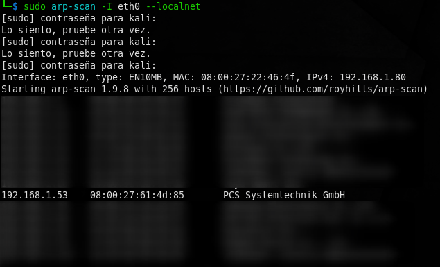

Parece que la máquina es de VirtualBox por el tipo de mac address que comienza por 08.

Hacemos un ping para ver si está online (o en cambio la info está cacheada)

```bash
> ping -c 1 192.168.1.53
```

```bash
PING 192.168.1.53 (192.168.1.53) 56(84) bytes of data.
64 bytes from 192.168.1.53: icmp_seq=1 ttl=64 time=15.4 ms

--- 192.168.1.53 ping statistics ---
1 packets transmitted, 1 received, 0% packet loss, time 0ms
rtt min/avg/max/mdev = 15.385/15.385/15.385/0.000 ms
```
-------------------------------------------------------------------------------
Y ahora realizamos un escaneo rápido para ver qué servicios están corriendo en la máquina:

```bash
> sudo nmap -sS -n -p1-1000 -Pn 192.168.1.53 
```

```bash
Starting Nmap 7.93 ( https://nmap.org ) at 2023-01-22 14:31 EST
Nmap scan report for 192.168.1.53
Host is up (0.0052s latency).
Not shown: 987 filtered tcp ports (no-response), 10 filtered tcp ports (admin-prohibited)
PORT    STATE SERVICE
22/tcp  open  ssh
80/tcp  open  http
443/tcp open  https
MAC Address: 08:00:27:61:4D:85 (Oracle VirtualBox virtual NIC)

Nmap done: 1 IP address (1 host up) scanned in 5.44 seconds
```

-------------------------------------------------------------------------------
 
Realizamos una prueba más exhaustiva de los servicios, escaneando todos los puertos pero no encontramos nada más.

Miremos pues qué versiones de servicios están corriendo por esos puertos:

```bash
> sudo nmap -sCV -n -p22,80,443 192.168.1.53
```

```bash
Starting Nmap 7.93 ( https://nmap.org ) at 2023-01-26 17:17 EST
Nmap scan report for 192.168.1.53
Host is up (0.0060s latency).

PORT    STATE SERVICE  VERSION
22/tcp  open  ssh      OpenSSH 8.6 (protocol 2.0)
| ssh-hostkey: 
|   256 5b2c3fdc8b76e9217bd05624dfbee9a8 (ECDSA)
|_  256 b03c723b722126ce3a84e841ecc8f841 (ED25519)
80/tcp  open  http     Apache httpd 2.4.51 ((Fedora) OpenSSL/1.1.1l mod_wsgi/4.7.1 Python/3.9)
|_http-server-header: Apache/2.4.51 (Fedora) OpenSSL/1.1.1l mod_wsgi/4.7.1 Python/3.9
|_http-title: Bad Request (400)
443/tcp open  ssl/http Apache httpd 2.4.51 ((Fedora) OpenSSL/1.1.1l mod_wsgi/4.7.1 Python/3.9)
| tls-alpn: 
|_  http/1.1
| http-methods: 
|_  Potentially risky methods: TRACE
|_http-title: Test Page for the HTTP Server on Fedora
| ssl-cert: Subject: commonName=earth.local/stateOrProvinceName=Space
| Subject Alternative Name: DNS:earth.local, DNS:terratest.earth.local
| Not valid before: 2021-10-12T23:26:31
|_Not valid after:  2031-10-10T23:26:31
|_ssl-date: TLS randomness does not represent time
|_http-server-header: Apache/2.4.51 (Fedora) OpenSSL/1.1.1l mod_wsgi/4.7.1 Python/3.9
MAC Address: 08:00:27:61:4D:85 (Oracle VirtualBox virtual NIC)

Service detection performed. Please report any incorrect results at https://nmap.org/submit/ .
Nmap done: 1 IP address (1 host up) scanned in 25.59 seconds
```

-------------------------------------------------------------------------------

Ahora podemos mirar qué tecnologías web están corriendo en la máquina víctima.

```bash
> whatweb 192.168.1.53:80                                     
```

```bash
http://192.168.1.53:80 [400 Bad Request] Apache[2.4.51][mod_wsgi/4.7.1], 
Country[RESERVED][ZZ], HTML5, HTTPServer[Fedora Linux][Apache/2.4.51 (Fedora) 
OpenSSL/1.1.1l mod_wsgi/4.7.1 Python/3.9], IP[192.168.1.53],
OpenSSL[1.1.1l], Python[3.9], Title[Bad Request (400)], 
UncommonHeaders[x-content-type-options,referrer-policy]
```

```bash
> whatweb 192.168.1.53:443
```

```bash
http://192.168.1.53:443 [400 Bad Request] Apache[2.4.51][mod_wsgi/4.7.1],
Country[RESERVED][ZZ], HTTPServer[Fedora Linux][Apache/2.4.51 (Fedora)
OpenSSL/1.1.1l mod_wsgi/4.7.1 Python/3.9], IP[192.168.1.53],
OpenSSL[1.1.1l], Python[3.9], Title[400 Bad Request]
```

-------------------------------------------------------------------------------

Si inspeccionamos las webs mediante un navegador, vemos que ambos puertos dan Bad Request (400) como respuesta.

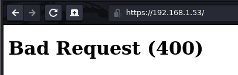

-------------------------------------------------------------------------------

Si tenemos en cuenta los resultados obtenidos en la última ejecución de nmap, podemos observar que se nombran 2 dominios relacionados con 192.168.1.53:

```bash
| Subject Alternative Name: DNS:earth.local, DNS:terratest.earth.local
```

Como no sabemos si se estará efectuando virtual hosting en la máquina que dependa del hostname, vamos a añadir esas entradas al archivo /etc/hosts

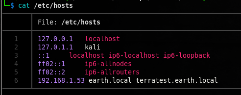

Ahora vamos a mirar que vemos en el browser:


para http://192.168.1.53

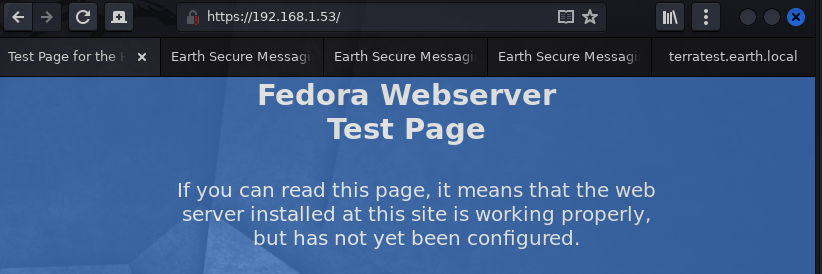

para http://earth.local o https://earth.local o http://terratest.earth.local

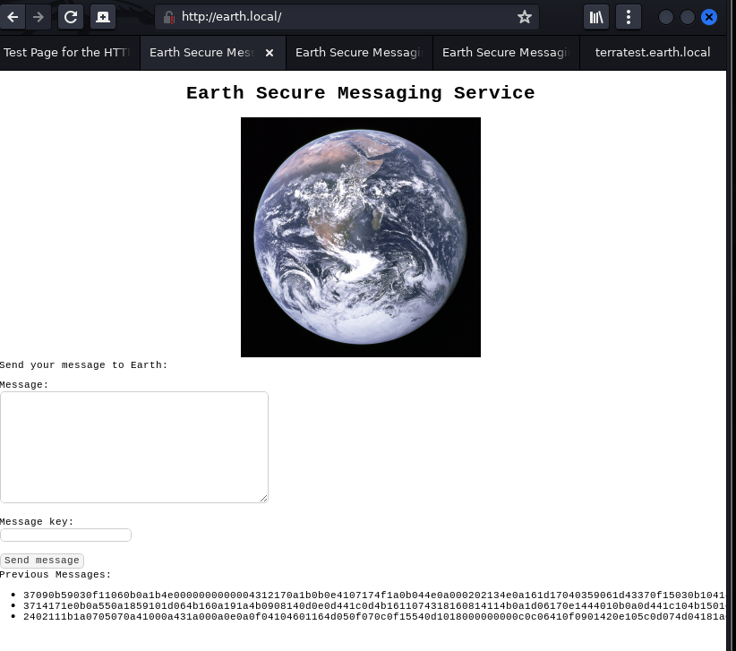

para https://terratest.earth.local

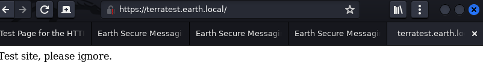

Y ahora volvemos a mirar whatweb pero con los dominios:

```bash
> whatweb http://earth.local                         
```

```bash
http://earth.local [200 OK] Apache[2.4.51][mod_wsgi/4.7.1], Cookies[csrftoken], Country[RESERVED][ZZ], Django, HTML5, HTTPServer[Fedora Linux][Apache/2.4.51 (Fedora) OpenSSL/1.1.1l mod_wsgi/4.7.1 Python/3.9], IP[192.168.1.53], OpenSSL[1.1.1l], Python[3.9], Title[Earth Secure Messaging], UncommonHeaders[x-content-type-options,referrer-policy], X-Frame-Options[DENY]
```

```bash
whatweb https://terratest.earth.local
```

```bash
https://terratest.earth.local [200 OK] Apache[2.4.51][mod_wsgi/4.7.1], Country[RESERVED][ZZ], HTTPServer[Fedora Linux][Apache/2.4.51 (Fedora) OpenSSL/1.1.1l mod_wsgi/4.7.1 Python/3.9], IP[192.168.1.53], OpenSSL[1.1.1l], Python[3.9]
```                                                        
-------------------------------------------------------------------------------

Vamos a ver si podemos descubrir páginas no listadas:

```bash
wfuzz --hc 400,404,403,405,500 -w /usr/share/SecLists/Discovery/Web-Content/directory-list-2.3-medium.txt http://earth.local/FUZZ     
```

```bash
********************************************************
* Wfuzz 3.1.0 - The Web Fuzzer                         *
********************************************************

Target: http://earth.local/FUZZ
Total requests: 220560

=====================================================================
ID           Response   Lines    Word       Chars       Payload                     
=====================================================================
000000014:   200        33 L     76 W       2595 Ch     "http://earth.local/"       
000000259:   301        0 L      0 W        0 Ch        "admin"                     
000045240:   200        33 L     76 W       2595 Ch     "http://earth.local/"       
000138620:   503        9 L      34 W       299 Ch      "u-god"                     

Total time: 0
Processed Requests: 220560
Filtered Requests: 220543
Requests/sec.: 0
```

Podemos ver que en la enumeración existe una página admin.

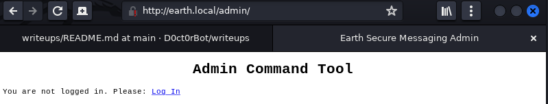

Y esta página abre un panel de autenticación:

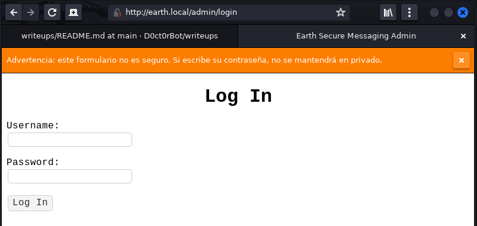

Y si abrimos burpsuite, podemos ver como se envían los valores de los campos:

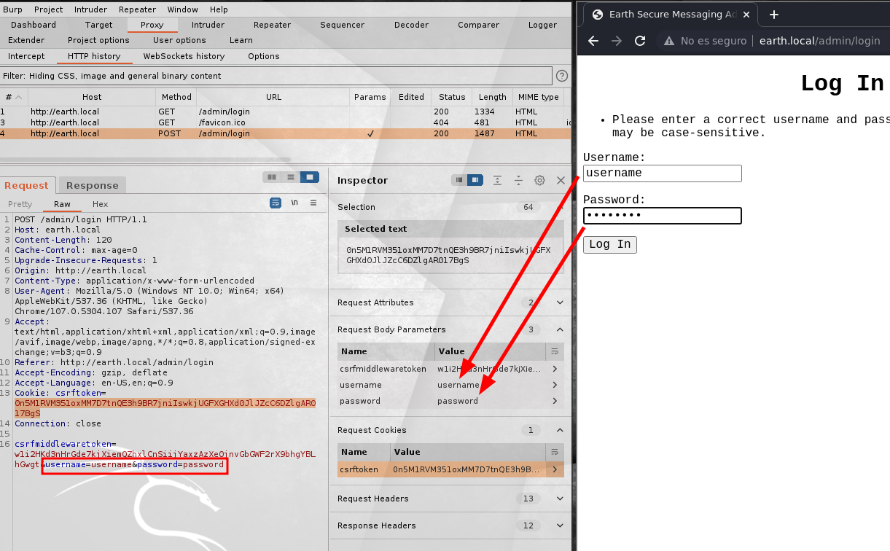

Como podemos ver hay una cookie:

```
Cookie: csrftoken=0n5M1RVM351oxMM7D7tnQE3h9BR7jniIswkjUGFXGHXd0JlJZcC6DZlgAR017BgS
```

También hay otro token como variable post que se envía junto al username y el password:

```
csrfmiddlewaretoken=w1i2HKd3nHrGde7kjXiemQZhxlCnSiijYaxzAzXe0jnvGbGWF2rX9bhgYBLhGwgt&username=username&password=password
```

Este token ya estaba mencionado en el código fuente de la página:

```html
<!doctype html>
<html lang="en">
<head>
<meta charset="utf-8">
<title>Earth Secure Messaging Admin</title>
 
<link rel="stylesheet" href="/static/styles.css">
</head>
<body>
<h1 class="aligncenter">Log In</h1>
<form method="post">


<input type="hidden" name="csrfmiddlewaretoken" value="I8gG1qDs8tH7XjGT1akqfpeilMx3nlRuBN1beVG1sMVsNEu3SKVeJZ0JaYxYUgWX">


<p><label for="id_username">Username:</label> <input type="text" name="username" autofocus autocapitalize="none" autocomplete="username" maxlength="150" required id="id_username"></p>
<p><label for="id_password">Password:</label> <input type="password" name="password" autocomplete="current-password" required id="id_password"></p>
<button type="submit">Log In</button>
</form>
</body>
</html>
```

No obstante este token va cambiando cada vez que se refresca la página.

Por otra parte, la página principal también mostraba un formulario de entrada de datos que podemos probar:

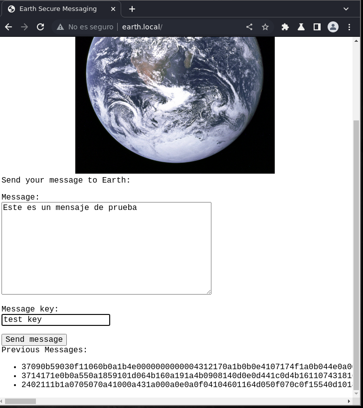

Y esto es lo que se ve en burpsuite:

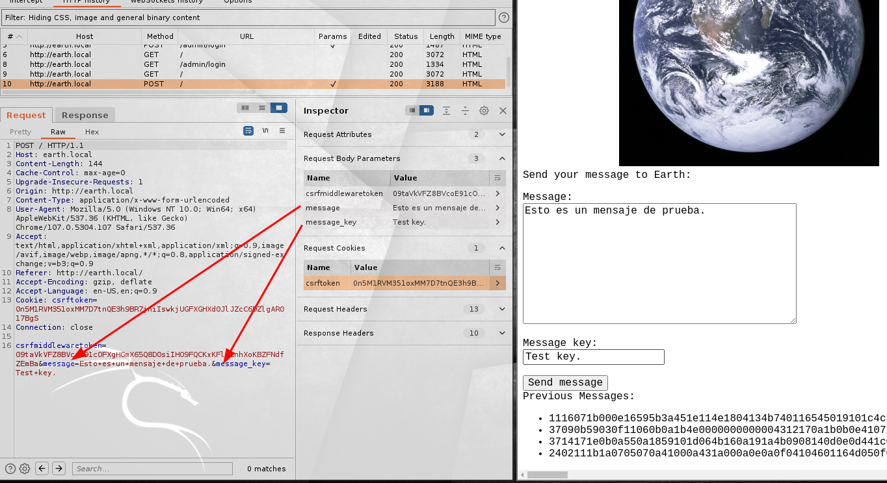

Como podemos ver, cada vez que se envía un mensaje se añade una entrada con un mensaje, al parecer codificado.

